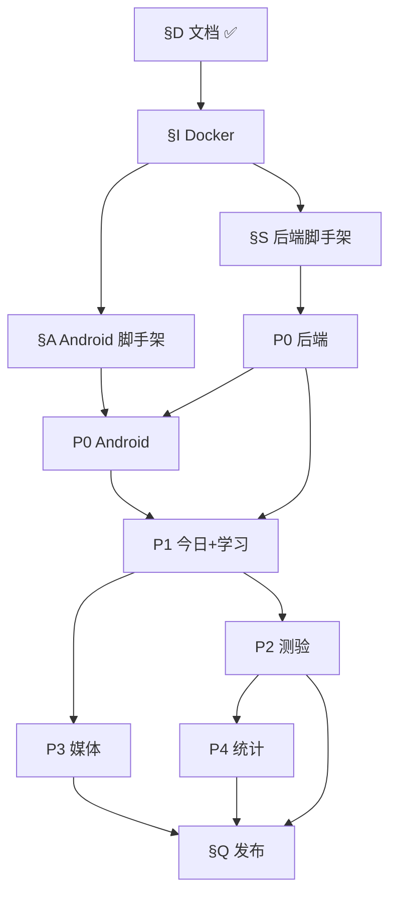

# WordFlip 任务清单（TASK）

> 版本：v1.8  
> 日期：2026-07-06  
> 用法：完成一项将 `[ ]` 改为 `[x]`。任务按依赖顺序排列，建议自上而下打勾。  
> 关联：[requirements.md](docs/wordflip/requirements.md) · [architecture.md](docs/wordflip/architecture.md) · [STRUCTURE.md](STRUCTURE.md)

---

## 进度总览

| 阶段 | 说明 | 进度 |
|------|------|------|
| **D** | 文档与设计（已定稿） | 16 / 18 |
| **I** | 基础设施 Docker | 7 / 8 |
| **S** | 后端脚手架 + 公共层 | 18 / 21 |
| **A** | Android 脚手架 + 公共层 | 9 / 14 |
| **P0** | 登录 + 词书 + 分组 | 13 / 50 |
| **P1** | 今日 + 学习 + SRS 读 | 15 / 28 |
| **P2** | 默写测验 + 掌握度写 | 9 / 24 |
| **P3** | 卡拍 + 图片 + 污渍 | 13 / 22 |
| **P4** | 统计 + 设置完善 | 8 / 14 |
| **Q** | 联调、测试、发布准备 | 0 / 12 |
| **B** | 二期 Backlog | — |

### 当前焦点（2026-07-06）

Android 采用 **Mock 数据 UI 先行**，不接真 API；Debug 包默认已登录。

| 区域 | 状态 |
|------|------|
| 五个 Tab | **全部 Mock UI 可点通**（设置 / 词书 / 分组 / 统计 / 今日） |
| 子页 | 学习 / 分组详情 / **默写测验（巩固+TTS）** / 卡拍 |
| 设置 | DataStore 持久化自动发音（默认开）+ 主题；开启发音时 TTS 不可用 Toast 提示 |
| 学习体验 | 扑克牌式打乱；FlipCard 展示用户图片 + 多类型污渍；详情/测验共用 `FlowingSyllableWord` 元音高亮 |
| P3 媒体 | 卡拍选图/拍照/编辑器 Mock；编辑器返回拦截；`MockWordMediaStore` 跨页共享；分组污渍模式 |
| 统计 | 近 12 周学习柱状图 |
| 后端 P0+ | 未启动（⛔ Docker I-07 / Flyway S-18） |

**已打通导航：** 今日 ↔ 学习 / 测验；词书保存；分组详情 → 学习 / 测验；分组卡 → 卡拍 / 污渍模式。

**建议下一波：** 启动 Docker + 后端 P0 Auth/Settings API，或 P1-A16 学习 session 上报。

---

## 使用说明

1. **单任务粒度**：每项应在 0.5～4 小时内可完成；过大则继续拆子项。  
2. **完成定义**：代码可运行 / 接口可 curl / UI 可点通 / 文档已更新，四选一写在该任务验收列。  
3. **阻塞**：在任务后标注 `⛔ 阻塞原因`，跳过前先记录。  
4. **不要并行破坏顺序**：例如 P2 测验依赖 P0 登录与 P1 分组数据。

---

## §D 文档与设计（已完成）

> 脚手架开发前的定稿交付物。

### D.1 产品需求

- [x] D-01 编写 `docs/wordflip/requirements.md` v6（掌握度三态、测验为准）
- [x] D-02 编写账号规格 `docs/wordflip/user-design.md`
- [x] D-03 附录 A：PRD 与 v5 差异对照
- [x] D-04 附录 B：v5 页面覆盖率核对
- [ ] D-05 修订 `docs/prd/WordFlip-PRD.md` 顶部「已被 v6 取代」声明
- [ ] D-06 同步 requirements v6.3（masteredCount、BOOK-8 措辞等小修正）

### D.2 技术设计

- [x] D-10 编写 `docs/wordflip/architecture.md`
- [x] D-11 编写 `docs/wordflip/database-design.md`（22 表）
- [x] D-12 编写 `docs/wordflip/api-modules.md`
- [x] D-13 编写 `wordflip-api/openapi.yaml` v1.0
- [x] D-14 编写 `docs/wordflip/android-ui-spec.md`
- [x] D-15 编写 `docs/wordflip/design-system/MASTER.md`

### D.3 仓库组织

- [x] D-20 Monorepo 目录整理（prototypes / docs / assets）
- [x] D-21 编写 `STRUCTURE.md`
- [x] D-22 编写根目录 `README.md`、`.gitignore`
- [x] D-23 各子目录占位 README（server / android / web / docker / api）
- [x] D-24 编写 `AGENTS.md` 与子目录 Agent 指令
- [x] D-25 代码中文注释规范（`coding-standards.md` + `.cursor/rules/chinese-comments.mdc`）

---

## §I 基础设施（Docker）

**验收**：`docker compose up -d` 后三服务健康，server 能连上。

- [x] I-01 编写 `docker/docker-compose.yml`（MySQL 8 / Redis 7 / MinIO）
- [x] I-02 编写 `docker/.env.example`（端口、默认密码占位）
- [x] I-03 MySQL：utf8mb4、时区 UTC、持久化 volume
- [x] I-04 Redis：持久化可选、端口 6379
- [x] I-05 MinIO：bucket `wordflip` 自动创建脚本或文档说明
- [x] I-06 更新 `docker/README.md` 启动与停止命令
- [ ] I-07 验证本机：`docker compose up -d` 无报错 ⛔ 需启动 Docker Desktop
- [x] I-08 记录 MinIO Console 默认账号与 bucket 创建步骤

---

## §S 后端脚手架与公共层

**验收**：空壳 Spring Boot 启动，Flyway 空迁移通过，Swagger UI 可访问。

### S.1 工程初始化

- [x] S-01 使用 Spring Initializr 创建 `wordflip-server`（Boot 3、Java 21）
- [x] S-02 添加依赖：Web、Security、JPA、Validation、Flyway、Redis、springdoc-openapi
- [x] S-03 配置 `application.yml` + `application-dev.yml`（MySQL / Redis / MinIO 地址）
- [x] S-04 设置 JPA `ddl-auto: validate`
- [x] S-05 创建包结构：`config / controller / service / domain / repository / dto / security / storage / exception`
- [x] S-06 配置 CORS（允许 Android 模拟器 / 真机调试源）

### S.2 数据库迁移

- [x] S-10 编写 `V1__init_schema.sql`（users、user_settings）
- [x] S-11 编写 V1 续：books、book_words、user_book_selection、user_word_lexicon
- [x] S-12 编写 V1 续：groups、group_words
- [x] S-13 编写 V1 续：word_mastery、review_plans
- [x] S-14 编写 V1 续：quiz_sessions、quiz_questions、quiz_answers
- [x] S-15 编写 V1 续：word_images、word_stains、study_logs
- [x] S-16 编写 V1 续：achievement_definitions、user_achievements
- [x] S-17 编写 `V2__seed_builtin_books.sql`（三本内置词书占位数据）
- [ ] S-18 本地启动验证 Flyway 迁移成功 ⛔ 依赖 I-07 Docker

### S.3 横切能力

- [x] S-20 实现统一 `ErrorResponse` + `@ControllerAdvice` 全局异常
- [ ] S-21 实现 JWT：Access 15min + Refresh 7d（Redis 存 Refresh）— 占位 `JwtPlaceholder`，P0 实现
- [x] S-22 实现 Spring Security 过滤器链（白名单 Auth 端点）
- [x] S-23 封装 MinIO `StorageService`（upload / delete / presigned URL）— 骨架占位
- [ ] S-24 封装 Redis 缓存工具（today 缓存 key 删除）
- [x] S-25 集成 springdoc：`/swagger-ui.html` 加载 openapi 或注解对齐

---

## §A Android 脚手架与公共层

**验收**：App 能安装启动，显示占位登录页或空壳导航。

### A.1 工程初始化

- [x] A-01 创建 `wordflip-android` 多模块工程（settings.gradle.kts）
- [x] A-02 创建模块：`app`、`core-network`、`core-model`、`core-ui`（+ 全部 feature/core 模块）
- [x] A-03 配置 Kotlin、Compose BOM、Material 3、Hilt、Navigation Compose
- [x] A-04 配置 `compileSdk` / `minSdk`（minSdk 26 / compileSdk 34）
- [x] A-05 应用 Natural Sage 主题（`core-ui` primary `#6F9038`）

### A.2 网络与模型

- [ ] A-10 OpenAPI Generator 配置：输入 `wordflip-api/openapi.yaml` → `core-model` — P0 前
- [ ] A-11 实现 Retrofit + OkHttp + Kotlin Serialization
- [ ] A-12 实现 Auth 拦截器（Bearer Token 注入）
- [ ] A-13 实现 Token 本地存储（EncryptedSharedPreferences 或 DataStore）
- [ ] A-14 实现 401 自动 Refresh Token 重试（一次）

### A.3 导航壳

- [x] A-15 实现底部 5 Tab 导航壳（设置 / 词书 / 分组 / 统计 / 今日）
- [x] A-16 实现子页面栈（Navigation 嵌套 graph，对齐 REQ-NAV-1~5）— Study / GroupDetail / Quiz Mock 子页已完成；CustomGroup / 卡拍待 P0/P3
- [x] A-17 实现 Toast 组件（底部导航上方居中，2s 消失）
- [x] A-18 登录态路由：未登录仅 Auth，已登录进 Main

---

## §P0 登录 + 词书 + 分组

**里程碑**：用户能注册登录 → 勾选词书 → 保存设置 → 看到自动/自定义分组列表。

### P0-B 后端 · Auth

- [ ] P0-B01 实体 `User` + `UserSettings` + Repository
- [ ] P0-B02 `POST /auth/register`（email 或 phone 二选一）
- [ ] P0-B03 `POST /auth/login`（account 自动识别）
- [ ] P0-B04 `POST /auth/refresh` + Refresh 轮换写 Redis
- [ ] P0-B05 `POST /auth/logout` 吊销 Refresh
- [ ] P0-B06 注册同事务创建 `user_settings` 默认行
- [ ] P0-B07 密码 BCrypt；登录失败不泄露账号是否存在

### P0-B 后端 · Settings & Books

- [ ] P0-B10 实体 `Book`、`BookWord`、`UserBookSelection`、`UserWordLexicon`
- [ ] P0-B11 `GET /books`（builtin + 当前用户 imported，含 selected）
- [ ] P0-B12 `GET /settings` + `PUT /settings`（bookIds + groupSize）
- [ ] P0-B13 `PATCH /settings/preferences`（autoSpeak、themeMode）
- [ ] P0-B14 `BookService`：distinct 词数、estimatedGroupCount 计算
- [ ] P0-B15 `PUT /settings` 后调用 `GroupService.appendGroupsForNewWords`
- [ ] P0-B16 增量 append：delta 计算、按 groupSize 切分、INSERT groups + group_words
- [ ] P0-B17 验证 UNIQUE(user_id, word_key) 冲突返回 409

### P0-B 后端 · 词书导入

- [ ] P0-B20 `BookImportService`：解析 JSON 格式
- [ ] P0-B21 解析 CSV / TXT 多分隔符（REQ-BOOK-6）
- [ ] P0-B22 `POST /books/import/preview` → Redis previewToken 15min
- [ ] P0-B23 `POST /books/import` confirm → books + book_words + selection + lexicon upsert
- [ ] P0-B24 `DELETE /books/{bookId}` 仅 imported；已入组词保留
- [ ] P0-B25 导入限流 Redis `rl:import:{userId}`

### P0-B 后端 · Groups

- [ ] P0-B30 实体 `Group`、`GroupWord` + Repository
- [ ] P0-B31 `GET /groups`（source 过滤、sort createdAt）
- [ ] P0-B32 `GET /groups/{groupId}` + 聚合 stats / progress
- [ ] P0-B33 `GET /groups/{groupId}/words` 分页 + 只读 mastery 占位（无测验时为 unlearned）
- [ ] P0-B34 `GET /words/unassigned`（分页 + all=true）
- [ ] P0-B35 `POST /groups/custom` 从未入组池创建 custom 分组

### P0-A Android · Auth

- [x] P0-A01 创建 `feature-auth` 模块
- [x] P0-A02 登录页 UI（account + password）— 占位 UI，任意输入可进 Main（Debug 默认跳过）
- [ ] P0-A03 注册页 UI（email 或 phone + password）
- [ ] P0-A04 `AuthViewModel` 对接 register / login API
- [ ] P0-A05 登录成功导航至今日页；失败 Toast
- [ ] P0-A06 设置页「退出登录」清除 Token 回登录页 — Mock 退出已接 NavHost；Token/API 待 P0

### P0-A Android · 词书

- [x] P0-A10 创建 `feature-books` 模块
- [x] P0-A11 词书列表页：内置三本 + imported 卡片
- [x] P0-A12 勾选切换 + 底部分组大小 10/20/30/50
- [x] P0-A13 汇总行：distinct 词数 · 每组 N · 约 M 组
- [x] P0-A14 「保存设置」调用 PUT /settings；Toast 成功 — Mock 本地模拟 append
- [ ] P0-A15 「导入单词书」文件选择 → preview → confirm 流程 — Toast 占位
- [x] P0-A16 删除 imported 词书确认对话框 — Mock 已完成，待接 DELETE API
- [ ] P0-A17 「手动添加分组」入口 → CustomGroup 页（见 P0-A21）— Toast 占位

### P0-A Android · 分组

- [x] P0-A20 创建 `feature-groups` 模块 — CustomGroup 子页待 P0-A21
- [ ] P0-A21 CustomGroup：拉取 unassigned chips，多选保存 — 待实现
- [x] P0-A22 分组列表页：组名、状态、四维统计、进度条
- [x] P0-A23 分组详情列表模式（只读掌握度 Chip，无手动改态按钮）
- [x] P0-A24 分组卡片快捷入口：卡拍 / 污渍 — 导航至 Snapshot / 分组详情污渍模式

### P0 联调验收

- [ ] P0-T01 curl/E2E：注册 → 登录 → GET /books
- [ ] P0-T02 勾选两本词书 → PUT /settings → 验证 appendedGroups
- [ ] P0-T03 导入 CSV 小词书 → 保存设置 → 新词入组
- [ ] P0-T04 Android 真机/模拟器走通 P0 全流程

---

## §P1 今日 + 学习 + SRS（读）

**里程碑**：今日任务数字正确；能进入学习页翻转卡片；掌握度只读展示。

### P1-B 后端 · Review & Today

- [ ] P1-B01 实体 `WordMastery`、`ReviewPlan` + Repository
- [ ] P1-B02 `ReviewService`：组装 `MasterySnapshot`（含 hasQuizHistory 默认 false）
- [ ] P1-B03 `GET /today`：stats（masteredCount、dueReviewCount、completionPercent）
- [ ] P1-B04 `GET /today`：tasks.newWords / dueReview / quiz 计数（REQ-TODAY-9~11）
- [ ] P1-B05 `GET /today`：recommendedStudy + streakDays
- [ ] P1-B06 时区：`X-Timezone` header 解析用户「当日」
- [ ] P1-B07 Redis 缓存 `today:{userId}:{yyyyMMdd}` + 写后失效钩子（占位）

### P1-B 后端 · Study

- [ ] P1-B10 `GET /study/groups/{groupId}` 聚合 WordCard（lexicon + mastery + image/stain 占位）
- [ ] P1-B11 `POST /study/sessions` upsert `study_logs`
- [ ] P1-B12 实体 `StudyLog` + 连续打卡 streak 计算

### P1-A Android · 今日

- [x] P1-A01 创建 `feature-today` 模块
- [x] P1-A02 今日页布局：问候 + 日期 +  streak（REQ-TODAY-1~2）
- [x] P1-A03 三格统计 + 三行任务（REQ-TODAY-3~4）
- [x] P1-A04 底部固定「开始学习」按钮
- [x] P1-A05 点击任务行 / 开始学习 → 导航至 Study（带 groupId）；默写测验任务 → Quiz

### P1-A Android · 学习

- [x] P1-A10 创建 `feature-study` 模块
- [x] P1-A11 两列卡片网格 + Flip 动画（对齐 v5 曲线）
- [x] P1-A12 打乱 / 全翻按钮与动画 — 参考 pukepai.html 扑克牌式打乱：散开 → 收拢成叠 → 发牌到新位置；视觉-数据解耦；发完牌即已打乱；打乱后自动回顶部；reduced motion 降级；全翻 Toast 已有
- [x] P1-A13 长按 BottomSheet 详情（词义、例句、词根）
- [x] P1-A14 首次引导浮层「长按查看详情」（REQ-STUDY-23）
- [x] P1-A15 自动发音 Toggle 联动（TTS）— 对齐 v5：每次翻转朗读；默认开启；TTS 异步就绪队列；详情页语速独立
- [ ] P1-A16 学习结束上报 POST /study/sessions
- [x] P1-A17 顶栏入口 → 测验页 — Mock 导航已打通

### P1-A Android · 分组详情增强

- [x] P1-A20 分组详情掌握度 Chip：未学习 / 模糊 / 不认识（只读）
- [x] P1-A21 分组 progress 进度条绑定 API — Mock 数据绑定，待接 GET /groups

### P1 联调验收

- [ ] P1-T01 新用户：新词 count = 已入组且无 quiz 记录词数
- [ ] P1-T02 学习页加载真实组内单词与释义
- [ ] P1-T03 学习 session 上报后 streak / study_logs 有记录

---

## §P2 默写测验 + 掌握度（写）

**里程碑**：测验判题更新三态与 SRS；今日任务随测验变化。

### P2-B 后端 · Quiz & applyQuizResult

- [ ] P2-B01 实体 `QuizSession`、`QuizQuestion`、`QuizAnswer`
- [ ] P2-B02 `POST /quiz/sessions` 抽题池（已入组 ∩ 到期 ∪ fuzzy/unknown）
- [ ] P2-B03 写入 `quiz_questions` 快照；同 session wordKey 不重复
- [ ] P2-B04 `POST /quiz/sessions/{id}/answer` 判题 trim + equalsIgnoreCase
- [ ] P2-B05 实现 `ReviewService.applyQuizResult` 状态机（三档 + stage + next_review_at）
- [ ] P2-B06 连续错题：查最近 quiz_answers → unknown
- [ ] P2-B07 首次答题 has_quiz_history = 1
- [ ] P2-B08 session 完成更新 score/status；upsert study_logs
- [ ] P2-B09 `GET /quiz/sessions/{id}/result` wrongWords 列表
- [ ] P2-B10 答题后删除 Redis today 缓存

### P2-A Android · 测验

- [x] P2-A01 创建 `feature-quiz` 模块
- [x] P2-A02 进入测验强制新建 session（REQ-NAV-6）— nonce ViewModelKey + startSession
- [x] P2-A03 题目 UI：进度条、题号、得分；顶词区 + 输入区 + 巩固提示三段布局
- [x] P2-A04 答对反馈 ~0.6s 自动下一题 + 手动「下一题」跳过
- [x] P2-A05 结果页：评价语、统计、错题列表
- [x] P2-A06 「再来一次」retry source；「返回」pop 栈 — Mock 本地 reSession
- [x] P2-A08 答错巩固：首次判题计分/错题；练习通过后方可下一题（Mock 本地）
- [x] P2-A09 巩固页：盖住单词同位换中文；TTS 朗读 + 元音流动动画 + 语速 ±
- [x] P2-A10 测验导航 `quiz/{source}` + `adjustResize` 键盘适配
- [ ] P2-A07 测验后刷新分组详情 / 今日页掌握度展示 — 待接 API

### P2 联调验收

- [ ] P2-T01 答对 → level=unlearned, stage+1, next_review_at 正确
- [ ] P2-T02 连续两次答错 → unknown
- [ ] P2-T03 分组详情掌握度仅随测验变化（学习翻转不改态）
- [ ] P2-T04 Android 完整测验 10 题流程 — Mock 可手工走通，待接 API 验证掌握度写入

---

## §P3 卡拍 + 图片 + 污渍

**里程碑**：能拍照/选图编辑保存；污渍生成与隐藏；学习页展示。

### P3-B 后端 · Images & Stains

- [ ] P3-B01 实体 `WordImage`、`WordStain`
- [ ] P3-B02 `POST /words/{wordKey}/image` multipart → 压缩 WebP → MinIO
- [ ] P3-B03 `GET/PATCH/DELETE /words/{wordKey}/image`
- [ ] P3-B04 `GET/PUT /words/{wordKey}/stain`（regenerate / hidden / replace）
- [ ] P3-B05 `POST /groups/{groupId}/stains/batch`
- [ ] P3-B06 默认 stain seed = stableHash(userId + wordKey) 无行时

### P3-A Android · 媒体

- [x] P3-A01 创建 `core-image` 模块（ImageTransform / ImageFilters / StainConfig 对齐 openapi）
- [x] P3-A02 创建 `feature-snapshot` 模块
- [x] P3-A03 卡拍页：组内卡片网格，无图背面可点出 Sheet
- [x] P3-A04 CameraX 拍照 + 相册选择 — TakePicture + PickVisualMedia
- [x] P3-A05 图片编辑器：裁剪/旋转/缩放/滤镜/showCn（对齐 v5）
- [x] P3-A06 保存 → POST image；清除 → DELETE — Mock `MockWordMediaStore`
- [x] P3-A07 学习页卡片背面展示用户图片 — Coil + WordImageBack
- [x] P3-A08 污渍渲染组件（Compose Canvas 多类型）— 咖啡/墨水/荧光/蜡笔/线条
- [x] P3-A09 详情抽屉污渍/照片：调色板/相机快捷按钮 + 下拉菜单 + 污渍迷你预览 + 显示/隐藏切换
- [x] P3-A10 分组详情污渍模式：筛选、单卡换、一键生成、显示/隐藏
- [x] P3-A11 学习页详情抽屉接入拍照/相册/图片编辑 — `StudyScreen` + `MockWordMediaStore`
- [x] P3-A12 图片编辑器系统返回拦截 + 全屏 overlay — 学习页/卡拍页 `BackHandler`
- [x] P3-A13 详情抽屉可滚动布局 — 避免照片/污渍操作被挤出可视区

### P3 联调验收

- [ ] P3-T01 上传图片后 GET 返回 presigned URL 可显示
- [ ] P3-T02 同一 wordKey 默认污渍 deterministic
- [ ] P3-T03 学习 / 卡拍 / 分组详情三处污渍一致

---

## §P4 统计 + 设置完善

**里程碑**：统计四宫格、热力图、成就；设置主题切换 MVP 可用。

### P4-B 后端 · Stats

- [ ] P4-B01 `GET /stats/summary`（masteredCount、streak、quizAccuracy、totalStudyDays）
- [ ] P4-B02 `GET /stats/heatmap` 近 N 月 study_logs activity_score 分级
- [ ] P4-B03 `GET /stats/achievements` + seed definitions
- [ ] P4-B04 成就解锁 lazy 写入 user_achievements

### P4-A Android · 统计与设置

- [x] P4-A01 创建 `feature-stats` 模块
- [x] P4-A02 统计四宫格 UI
- [x] P4-A03 学习活动柱状图（近 12 周）+ 说明文案 + 图例 — 替代原 4 级热力日历
- [x] P4-A04 成就列表（已解锁 / 未解锁样式）
- [x] P4-A05 创建 `feature-settings` 模块
- [x] P4-A06 自动发音 Toggle + DataStore 持久化 + Toast — 默认开；开启时 TTS 不可用提示；待 PATCH preferences API
- [x] P4-A07 外观：跟随系统 / 浅色 / 深色（REQ-SETTINGS-7）— DataStore + 即时生效
- [x] P4-A08 规划项入口保留占位（艾宾浩斯方案、提醒、导出）— Toast 占位

### P4 联调验收

- [ ] P4-T01 测验后 quizAccuracy 变化 — Mock 静态数据，待接 GET /stats
- [ ] P4-T02 主题切换立即生效且持久化 — Mock DataStore 已验证，待服务端同步

---

## §Q 联调、测试、发布准备

- [ ] Q-01 后端：核心 Service 单元测试（applyQuizResult、appendGroups）
- [ ] Q-02 后端：Auth + Settings 集成测试（MockMvc）
- [ ] Q-03 Android：ViewModel 单测（可选高价值路径）
- [ ] Q-04 手工测试清单：对照 requirements 附录 B 逐页勾选
- [ ] Q-05 性能：分组 500 词 append < 3s（本地基准）
- [ ] Q-06 安全：上传文件类型与大小限制
- [ ] Q-07 编写 `wordflip-server/Dockerfile`
- [ ] Q-08 生产 `application-prod.yml` 模板（不含密钥）
- [ ] Q-09 Android release build + 签名配置说明
- [ ] Q-10 更新根 README：本地启动完整步骤
- [ ] Q-11 打 Git tag `v0.1.0-mvp`
- [ ] Q-12 MVP 演示脚本（注册 → 导入 → 学习 → 测验 → 统计）

---

## §B 二期 Backlog（不在 MVP）

> 完成 MVP 后再拆入 TASK v2。

- [ ] B-01 React `wordflip-web` 脚手架 + 登录 + 今日页
- [ ] B-02 Web 卡片学习简化版
- [ ] B-03 FCM 推送 + 每日/复习提醒（REQ-SETTINGS-4）
- [ ] B-04 词书导出 CSV / Anki（REQ-SETTINGS-5）
- [ ] B-05 每本词书「已掌握/总数」进度（REQ-BOOK 规划项）
- [ ] B-06 自定义任意分组大小输入
- [ ] B-07 短信验证码登录 / 找回密码
- [ ] B-08 Room 离线缓存增强
- [ ] B-09 多设备同步方案选型与实现

---

## 任务依赖简图

---

## 修订记录

| 日期 | 版本 | 说明 |
|------|------|------|
| 2026-06-30 | v1.0 | 初版：D/I/S/A + P0～P4 + Q + Backlog |
| 2026-07-02 | v1.1 | 同步 Android Mock UI 进度：词书/分组/今日/学习/测验；修正各阶段完成数；补充当前焦点 |
| 2026-07-02 | v1.2 | P4 统计+设置 Mock UI；主题 DataStore；TASK 进度更新 |
| 2026-07-02 | v1.3 | Android Mock 全流程；UX 修复（留白、FlipCard、TTS、统计柱状图） |
| 2026-07-03 | v1.4 | P1-A12 打乱飞出/飞入动画；设置页 TTS 不可用 Toast |
| 2026-07-05 | v1.5 | 学习页打乱动画升级：参考 pukepai.html 散开 → 收拢 → 发牌；打乱后回顶部；视觉-数据解耦 |
| 2026-07-06 | v1.6 | P3 Android Mock：卡拍/图片编辑器/多类型污渍；MockWordMediaStore 跨页共享；分组污渍模式 |
| 2026-07-06 | v1.7 | 学习页详情抽屉污渍/照片紧凑 UX + 迷你预览；图片编辑返回拦截；分组卡拍/污渍导航打通 |
| 2026-07-06 | v1.8 | P2 测验巩固流程：答错练习 gate、三段布局、盖住换中文、TTS/元音动画；FlowingSyllableWord 迁至 core-ui；污渍离屏渲染修复 |

---

## 相关文档

- [STRUCTURE.md](STRUCTURE.md) — 代码放哪  
- [docs/wordflip/architecture.md](docs/wordflip/architecture.md) §11 — MVP 分期  
- [wordflip-api/openapi.yaml](wordflip-api/openapi.yaml) — 端点清单  
