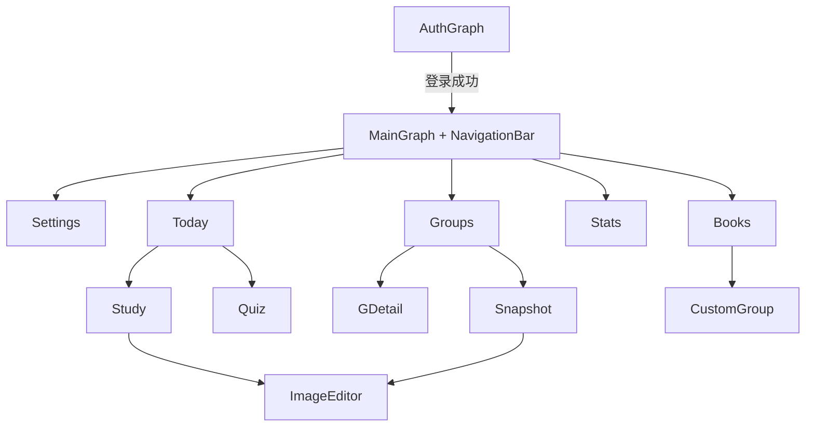

# WordFlip Android UI/UX 规格说明

> 版本：v1.1  
> 日期：2026-06-30  
> 平台：Kotlin · Jetpack Compose · Material 3  
> 关联：[design-system/MASTER.md](./design-system/MASTER.md) · [requirements.md](./requirements.md) · [architecture.md](./architecture.md) · [user-design.md](./user-design.md)

本文档规定 WordFlip **Android 客户端**的界面结构、交互、组件与双主题行为。业务逻辑以 `requirements.md` v6 为准；视觉 token 以 `design-system/MASTER.md` 为准。

---

## 1. 设计定位

| 维度 | 定稿 |
|------|------|
| 产品类型 | 教育 / 词汇卡片 / 日常学习 |
| 主路径 | 登录 → 今日 → 学习 / 测验 |
| 视觉 | **Natural Sage**：纸感 `#F7F6F2` + 主色 `#6F9038` + 品牌软绿 `#B7D07A` |
| 主题 | **Light + Dark**；设置内切换（跟随系统 / 浅色 / 深色） |
| 网络 | MVP 必须联网；离线/失败统一 Error 态 + 重试 |
| v5 关系 | 布局与交互参考 `prototypes/wordflip-v5.html`；掌握度、分组、登录以 v6 为准 |

---

## 2. 设计系统摘要

完整色板见 [MASTER.md](./design-system/MASTER.md)。

**主色用法：**

- **主按钮、Tab 选中、开始学习**：`primary` `#6F9038`（Light）/ `#8FAF5C`（Dark）
- **任务图标底、选中 chip、轻强调块**：`primaryContainer` `#B7D07A`（Light）/ 深绿容器（Dark）
- **统计「已掌握」**：`success` `#0B7B5C`，**不是** primary，避免与品牌绿混淆

**图标：** 见 [§8 图标设计](#8-图标设计) 与 MASTER §4。

---

## 3. 导航架构



| 层级 | 实现 |
|------|------|
| 未登录 | `AuthGraph`：Login / Register |
| 已登录 | `MainGraph` + `NavigationBar`（5 项） |
| Tab 顺序 | **设置 → 词书 → 分组 → 统计 → 今日**（默认选中今日） |
| 子页面 | `NavHost` 栈 + `TopAppBar` 返回；支持 Predictive Back |
| 全屏 | 图片编辑器、首次学习引导 |
| Expanded ≥600dp | `NavigationRail` + 内容区（列数自适应） |

---

## 4. 掌握度展示（v6）

| 状态 | UI | 可编辑 |
|------|-----|--------|
| 未学习 | Chip + 图标 | **否** |
| 模糊 | Chip + 图标 | **否** |
| 不认识 | Chip + 图标 | **否** |

- **最终状态由默写测验更新**（REQ-QUIZ-6）
- 学习页卡片 **不显示** Chip；分组详情 **只读** 展示
- 禁止 v5 的「记得/模糊」手动按钮

---

## 5. 逐屏规格

每屏须实现状态：**Loading / Content / Empty / Error / Offline**（android-ui-ux-design）。

### 5.1 登录 / 注册

- 居中表单；WordFlip 字标 + slogan
- 字段：账号（邮箱或手机）、密码（显示/隐藏）
- 主 CTA：`FilledButton` 登录；`TextButton` 注册
- 校验：blur 后 inline 错误；提交时按钮 loading

### 5.2 今日（首页）

- **REQ-TODAY-1**：compact 下主内容尽量不滚动；**「开始学习」固定于 NavBar 上方**
- 结构：问候 + 日期 + 连续天 Badge → 三格统计 → 三任务行 → 固定 CTA
- 三任务：新词学习 / 到期复习 / 默写测验（数量来自服务端）
- CTA 文案示例：「开始学习 · 第3组 · 20 词」
- 通知：`IconButton` → MVP Snackbar 占位

### 5.3 词书

- 词书 `LazyColumn` + Checkbox；导入项带「已导入」标签与删除（确认 Dialog）
- 分组大小 10/20/30/50；汇总「已选 X 词 · 每组 N · 约 M 组」
- Sticky 底栏：汇总 + **保存设置**（触发增量追加分组，REQ-BOOK-17~21）
- 导入：系统文件选择 → BottomSheet 确认

### 5.4 分组管理

- 组卡片：状态 Badge、**未学习/模糊/不认识/总词**、进度条
- 快捷：`PhotoCamera` 卡拍、`Palette` 污渍（48dp 触控）
- 点击卡片 → 分组详情

### 5.5 分组详情

- **列表模式**：单词 + 只读掌握度 Chip；顶栏：返回、污渍、开始学习
- **污渍模式**：FilterChip 类型、一键生成、2 列预览网格
- **无** 手动改掌握度

### 5.6 卡片学习

- 网格：Compact 2 列；宽高比 **3:4.2**
- `FlipCard`：spring 翻转；正面污渍；背面释义/用户图
- 工具栏：打乱、全翻；顶栏：测验入口
- 长按 500ms → `ModalBottomSheet`（详情、发音、卡拍、污渍）
- 首次引导：「长按卡片查看详细释义」

### 5.7 默写测验

- 一题一屏；进度条 + 题号 + 得分
- 判题 1.4s 反馈；对/错更新服务端三态
- 结果页：评价 + 统计 + 再来一次 / 返回

### 5.8 卡拍与图片编辑

- 2 列网格；无图占位「点击添加图片」
- 有图：More 菜单（编辑/换图/中文/清除）
- 编辑器：虚线边界预览；保存后刷新各页

### 5.9 统计

- 四宫格 KPI；3 个月热力图（双主题色阶见 MASTER）
- 成就列表；锁定项降 emphasis

### 5.10 设置

- Toggle：翻转自动发音
- **外观**：跟随系统 / 浅色 / 深色（REQ-SETTINGS-7）
- 退出登录（与普项区隔）
- 艾宾浩斯/提醒/导出：MVP 占位 Snackbar

---

## 6. 主题切换

| 项 | 规范 |
|----|------|
| 选项 | `SYSTEM` / `LIGHT` / `DARK` |
| 默认 | `SYSTEM` |
| 持久化 | `user_settings.theme_mode` + 本地 DataStore 缓存 |
| 切换 | 立即生效，无需重启 |
| 实现 | `WordFlipTheme(darkTheme = …)` 读取用户偏好 |

Light / Dark 全屏验收清单见 MASTER §2–3 与 §8 修订说明。

---

## 7. 组件库（Compose）

| 组件 | 职责 |
|------|------|
| `WordFlipTheme` | Light/Dark ColorScheme + Typography |
| `WordFlipScaffold` | TopBar + 可选 bottom CTA + NavBar |
| `FlipCard` | 双面翻转、污渍层 |
| `MasteryChip` | 三态只读 |
| `StatTripleRow` | 今日三格 |
| `TaskRow` | 任务行 |
| `BookListItem` | 词书勾选 |
| `GroupCard` | 分组卡片 |
| `WordFlipBottomSheet` | 详情 / 选图 |
| `QuizFeedbackOverlay` | 对错反馈 |
| `EmptyStateView` / `NetworkErrorView` | 空态与错误 |

---

## 8. 图标设计

### 8.1 三层体系

| 层级 | 内容 | MVP |
|------|------|-----|
| **应用图标** | Launcher / 商店 Adaptive Icon | 需单独设计一稿 |
| **功能图标** | Material Symbols，应用内统一 | 全部使用 |
| **装饰/空态** | 可选矢量插画（空书架、空卡片） | 可选 |

应用内 **禁止** 用 emoji 作导航、设置、工具栏图标（成就/测验结果页少量 emoji 除外）。

### 8.2 应用图标（Launcher）

**概念：** 暖纸色底 + **翻转的单张圆角卡片** + 鼠尾草绿 `#6F9038` / `#B7D07A` 点缀。

| 项 | 规范 |
|----|------|
| 形态 | Android Adaptive Icon：foreground 卡片 + background 暖纸 `#F7F6F2` 或浅绿渐变 |
| 识别 | 暗示「翻转/卡片」，可含抽象 **W** 折线；避免泛用毕业帽、单书本 |
| 气质 | 卡片 · 翻转 · 自然 · 安静 |
| 与 app 内 | Launcher **独立设计**，不与 Tab 图标共用同一素材 |

### 8.3 功能图标库

**库：** `androidx.compose.material:material-icons-extended`（Material Symbols **Outlined** 为主）。

| Token | 值 |
|-------|-----|
| 默认尺寸 | 24dp |
| 小标签 | 20dp |
| 空态插画区 | 48dp |
| 线宽 | Outlined 400；Tab **选中** 可切 **Filled** 变体 |
| 着色 | `onSurface` / `primary` / 语义 token；**禁止**硬编码 hex |
| 触控 | 视觉 24dp 时点击区域 **≥ 48dp** |

### 8.4 底部导航（5 Tab）

| Tab | Outlined 图标 | 选中态 |
|-----|---------------|--------|
| 设置 | `Settings` | `primary` 色 + label 加粗；图标可 Filled |
| 词书 | `MenuBook` | 同上 |
| 分组 | `GridView` | 同上 |
| 统计 | `BarChart` | 同上 |
| 今日 | `Today` | 同上 |

### 8.5 功能映射表

**学习 / 卡片**

| 动作 | Material Symbol |
|------|-----------------|
| 打乱 | `Shuffle` |
| 全翻正面 | `FlipToFront` |
| 全翻背面 | `FlipToBack` |
| 发音 | `VolumeUp` |
| 进入测验 | `Spellcheck` |
| 开始学习 | `PlayArrow` |
| 返回 | `ArrowBack` |

**卡拍 / 图片**

| 动作 | Material Symbol |
|------|-----------------|
| 卡拍入口 | `PhotoCamera` |
| 相册 | `PhotoLibrary` |
| 编辑 | `Edit` |
| 更多 | `MoreVert` |
| 删除图片 | `Delete` |

**污渍**

| 动作 | Material Symbol |
|------|-----------------|
| 污渍模式 | `Palette` |
| 换一个 | `Refresh` |
| 显示/隐藏 | `Visibility` / `VisibilityOff` |

**词书 / 分组**

| 动作 | Material Symbol |
|------|-----------------|
| 导入 | `UploadFile` |
| 删除词书 | `DeleteOutline` |
| 通知 | `Notifications` |

**掌握度 Chip（须配文字）**

| 状态 | Material Symbol |
|------|-----------------|
| 未学习 | `RadioButtonUnchecked` |
| 模糊 | `HelpOutline` |
| 不认识 | `PriorityHigh` |

**登录 / 设置**

| 动作 | Material Symbol |
|------|-----------------|
| 密码可见性 | `Visibility` / `VisibilityOff` |
| 退出登录 | `Logout` |
| 外观主题 | `DarkMode` / `LightMode` / `SettingsBrightness` |

**测验反馈**

| 结果 | Material Symbol + 色 |
|------|----------------------|
| 答对 | `CheckCircle` + `success` |
| 答错 | `Cancel` + `error` |

### 8.6 污渍与图标边界

- **污渍**为卡片正面 Canvas/SVG 纹理，**不属于** Material Icons 体系。
- 图标仅用于：进入污渍模式、换一个、显示/隐藏。
- Dark 下污渍 opacity 见 MASTER §3.5。

### 8.7 实施（MVP）

1. 全 app 接入 Material Symbols Extended，不混用 Feather/Font Awesome/自定义 PNG  tab 图标。
2. 交付 Adaptive Launcher Icon（512px + foreground/background XML）。
3. 成就 badge 若需插画，使用与 icon 分离的统一空态插画风格。

### 8.8 Anti-Patterns

- Tab / 工具栏使用 emoji
- 每个 Tab 不同强调色（抢 `primary` 语义）
- 18dp 可点图标、无 hit area 扩展
- Launcher 与应用内 icon 视觉完全无关

---

## 9. 无障碍

- 触控 ≥ 48dp
- `contentDescription` 覆盖 IconButton、翻转卡
- 三态 Chip：朗读「掌握度，模糊」等完整语义
- 支持系统字体缩放、TalkBack、**Reduced motion**（翻转/打乱降级）

---

## 10. 动效优先级

| 优先级 | 动效 |
|--------|------|
| P0 | 卡片翻转、Tab/子页转场、测验反馈 |
| P1 | 打乱、Sheet |
| P2 | 统计热力图渐变 |

---

## 11. 模块划分（Android）

```
wordflip-android/
├── feature-auth/
├── feature-today/
├── feature-books/
├── feature-groups/
├── feature-study/
├── feature-snapshot/
├── feature-quiz/
├── feature-stats/
├── feature-settings/
├── core-ui/          # Theme, FlipCard, Scaffold
├── core-network/
├── core-model/
└── core-image/
```

---

## 12. 修订记录

| 日期 | 版本 | 说明 |
|------|------|------|
| 2026-06-30 | v1.0 | 初版：Compose 全屏规格；Natural Sage 主色；Light/Dark 双主题 |
| 2026-06-30 | v1.1 | 新增 §8 图标设计：Material Symbols、Launcher 概念、全量映射表 |
