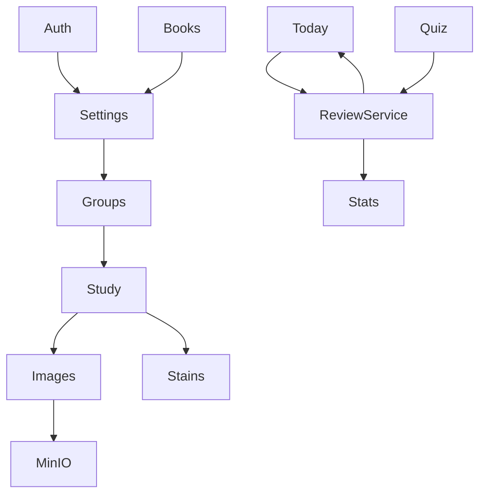

# WordFlip API 模块划分说明

> 版本：v1.2  
> 日期：2026-07-09  
> 契约文件：[../../wordflip-api/openapi.yaml](../../wordflip-api/openapi.yaml)  
> 数据库：[database-design.md](./database-design.md)  
> 关联：[architecture.md](./architecture.md) · [requirements.md](./requirements.md)

---

## 1. 总览

| 模块 | Tag | 职责 | 后端 Service |
|------|-----|------|--------------|
| Auth | `Auth` | 注册、登录、刷新、登出 | `AuthService` |
| Settings | `Settings` | 用户偏好、词书勾选、分组大小 | `SettingsService` + `BookService` |
| Books | `Books` | 词书列表、导入、删除 | `BookService` + `BookImportService` |
| Words | `Words` | 未入组词池 | `GroupService` |
| Groups | `Groups` | 分组 CRUD 视图、自定义分组 | `GroupService` |
| Study | `Study` | 学习页聚合、学习 session 上报 | `StudyService` |
| Today | `Today` | 今日仪表盘 | `ReviewService` + `StatsService` |
| Quiz | `Quiz` | 测验会话、判题、**唯一掌握度写入口** | `QuizService` → `ReviewService` |
| Images | `Images` | 卡拍图片元数据 | `ImageService` |
| Stains | `Stains` | 污渍配置 | `StainService` |
| Stats | `Stats` | 统计、热力图、成就 | `StatsService` |

**Base URL：** `/api/v1`  
**认证：** JWT Bearer（除 Auth 外全部必需）

---

## 2. 核心业务流程

### 2.1 词书保存 → 增量分组

```
PUT /settings { bookIds, groupSize, groupStrategy? }
  → SettingsService 持久化（bookIds 顺序写入 user_book_selection.selected_at 递增）
  → GroupService.appendGroupsForNewWords(userId)
       按 groupStrategy 合并已勾选词书 wordKey（去重保序）：
         book_order — 词书勾选顺序 + 书内 sort_order
         frequency  — 暂回退 book_order（无词频数据）
         random     — 稳定随机（seed = userId + bookIds）
       delta = 有序词表 − 已在 group_words 中的 wordKey
       若 delta 非空：
         若最后一个 auto 组未满 groupSize → 先补齐该组
         剩余 delta 按 groupSize 切分 → INSERT 新 groups(source=auto) + group_words
  → 响应 appendedGroups
  → TodayCacheService.invalidateAllForUser(userId)
```

**不变量（增量模式）：** 不 DELETE/重建已有 auto groups；`UNIQUE(user_id, word_key)`。

### 2.1.1 重新分组（REQ-BOOK-26）

```
PUT /settings { bookIds, groupSize, groupStrategy?, regroup: true }
  → SettingsService 持久化
  → GroupService.regroupAutoGroups(userId)
       DELETE 全部 groups(source=auto)（group_words CASCADE）
       custom 组内 wordKey 保留，不参与重建
       按 groupStrategy 对当前勾选词书全量排序去重
       减去 custom 已占 wordKey → 按 groupSize 切分新建 auto 组
  → 响应 appendedGroups（新建组列表）
  → TodayCacheService.invalidateAllForUser(userId)  // regroup 后 groupId 变更，须清 Today 缓存
```

**保留：** custom 分组、`word_mastery`、`review_plans`、图片、污渍。

### 2.2 掌握度、稳定性 S 与 SRS（仅测验写入；按 skill 双轨）

```
POST /quiz/sessions/{id}/answer
  → QuizService 判题
       默写：trim + equalsIgnoreCase(answer, expectedEn)
       选择：selectedKey == correctKey
  → 题型映射 skill：dictation→dictation；choice_en_cn/choice_cn_en→choice
  → ReviewService.applyQuizResult(userId, wordKey, skill, correct)
  → 更新 word_skill_progress（该 skill 的 level + S + SRS）+ quiz_answers
  → 失效 Redis today/stats 缓存
```

**不提供** `PATCH /words/{wordKey}/mastery`。学习翻卡不写 S。

#### skill 双轨与题型

| QuestionType | Skill | 作答字段 |
|--------------|-------|----------|
| `dictation` | `dictation` | `answer`（英文拼写） |
| `choice_en_cn` | `choice` | `selectedKey` |
| `choice_cn_en` | `choice` | `selectedKey` |

- **热力 / SRS 按 skill 独立：** 同一 `wordKey` 的默写与选择互不影响对方的 `stability`、`stage`、`nextReviewAt`、队列三态。
- **展示热力：** `WordProgressSnapshot` 含 `dictation` + `choice` 两份 `MasterySnapshot`，以及按用户 `heatDisplayMode` 算出的 `displayHeatLevel` / `displayStability`（`combined`/`free` 默认取较低档）。
- **开测：** `CreateQuizSessionRequest` 支持 `source`=`today|study|retry|groups|all|recent`，`groupIds` 多组，`questionTypes`，`launchMode`=`mixed|free_select`。

#### applyQuizResult — 队列三态 + SRS（单 skill）

SRS 间隔数组（天）：`INTERVALS = [1, 2, 4, 7, 15, 30]`，索引 `0..5` 对应 `stage`。

| 条件 | level | stage | nextReviewAt |
|------|-------|-------|--------------|
| 答对 | `unlearned` | `min(stage+1, 5)` | 用户时区当日结束 + `INTERVALS[newStage]` 天 |
| 答错（非连续第 2 次） | `fuzzy` | `max(stage-1, 0)` | 当日结束 + 1 天 |
| 同一 wordKey+**skill** **跨 session** 连续第 2 次答错 | `unknown` | `0` | **当日结束**（优先队列） |

#### applyQuizResult — 稳定性 S（与上表同事务，按 skill）

常量：`WINDOW_HOURS=24`，`CAP_CORRECT_IN_WINDOW=1.00`，`GAIN_MAX=4.0`，单次答对夹紧 `[0.05, 3.00]`。

```
S_days = 0.5 + (S/100)*59.5
gapDays = hours(lastQuizAt, now)/24   // 无历史 → 0
R = exp(-gapDays / S_days)

答对: delta = clamp(GAIN_MAX*(1-R), 0.05, 3.00)
      再 min(delta, CAP - windowCorrectGain)；窗满则 0
答错: deltaMinus = 1.5 + 2.0*R
      窗内第 2 次 ×1.5；第 3 次及以上 ×2.0；上限 8.0
S = clamp(S ± delta, 0, 100)
```

heatLevel 映射：`0(0–9.9) 1(10–29.9) 2(30–54.9) 3(55–79.9) 4(80–100)`。

- **连续答错判定：** 查 `quiz_answers` 该用户该 wordKey+**skill** 最近一条历史记录；若存在且 `correct=false`，则本次答错视为连续第 2 次。
- **`unlearned` 双义：** 用响应字段 `hasQuizHistory` 区分「该 skill 新词未测验」与「测验通过后 SRS 在档」。
- **已掌握统计：** 展示口径按 `heatDisplayMode`；默认综合轨 `displayStability >= 80` 且最近测验成功且建议间隔 ≥ 30 天（REQ-EBBING-7）。
- **分组 progress：** `count(displayStability >= 80) / total`（或按设置单轨）。
- **学习完成度：** `round(masteredCount / 已入组总词数 × 100)`，总词数为 0 时返回 0。

### 2.3 词书导入（两阶段）

```
POST /books/import/preview  (multipart file)
  → 解析 JSON/CSV/TXT，返回 previewToken + 预览

POST /books/import  { previewToken, name }
  → 确认入库，自动勾选，不自动追加分组
  → 用户需 PUT /settings 触发 append
```

### 2.4 污渍默认 seed

- 无自定义记录时：`seed = stableHash(userId + wordKey)`，保证 REQ-STAIN-1 确定性。
- `regenerate` / `batch` 使用新随机 seed 并持久化。

### 2.5 学习日志

| 触发 | 行为 |
|------|------|
| `POST /study/sessions` | 客户端学习结束上报；upsert `study_logs` |
| Quiz session `completed` | 服务端自动 upsert `study_logs`（按答对/总题数计分） |

---

## 3. 模块依赖



---

## 4. 横切约定

| 项 | 约定 |
|----|------|
| wordKey | `en.trim().toLowerCase()`，URL 路径需 encode |
| 分页 | `page`（1-based）、`size`（默认 20，最大 100） |
| 错误体 | `{ code, message, timestamp, path, details? }` |
| 时区 | 服务端存 UTC；`GET /today` 按 `X-Timezone: Asia/Shanghai` 或用户 profile 计算「当日」 |
| 幂等 | DELETE 图片、重复 PUT settings 相同 body |

---

## 5. 评审闭合项（相对初稿）

| 问题 | 定稿 |
|------|------|
| 未入组词池无读 API | 新增 `GET /words/unassigned` |
| 导入单阶段模糊 | 拆 preview + confirm |
| Settings 职责分裂 | `PUT /settings` 触发 append；`PATCH /settings/preferences` 仅偏好 |
| study_logs 无写 API | 新增 `POST /study/sessions` + Quiz 内部写入 |
| 仅改图片 transform | 新增 `PATCH /words/{wordKey}/image` |
| openapi 缺失 | `wordflip-api/openapi.yaml` |

---

## 6. 修订记录

| 日期 | 版本 | 说明 |
|------|------|------|
| 2026-06-30 | v1.0 | 初版：模块划分 + 业务规则定稿 |
| 2026-06-30 | v1.1 | 补充 completionPercent 口径；对齐 openapi.yaml v1.0 |
| 2026-07-09 | v1.2 | skill 双轨 dictation/choice；题型与组测/最近组；对齐 openapi v1.1 |
