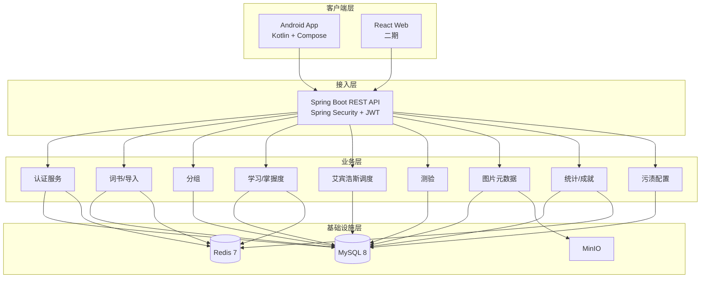

# WordFlip 技术选型与架构设计

> 版本：v1.6  
> 日期：2026-06-30  
> 状态：**已定稿（MVP 阶段）**  
> 关联文档：[requirements.md](./requirements.md) · [user-design.md](./user-design.md) · [android-ui-spec.md](./android-ui-spec.md) · [api-modules.md](./api-modules.md) · [database-design.md](./database-design.md) · [openapi.yaml](../../wordflip-api/openapi.yaml) · [STRUCTURE.md](../../STRUCTURE.md) · [WordFlip-PRD.md](../prd/WordFlip-PRD.md) · 原型 [wordflip-v5.html](../../prototypes/wordflip-v5.html)

本文档汇总 WordFlip 从 MVP 到全端扩展的**技术选型、系统架构、模块边界与基础设施设计**。业务行为以 `requirements.md` 为准；本文档只描述技术实现层面。

> **待修订（词库结构化）：** §4.6 单词模型将改为 Headword 1—n Sense 1—n Example；离线清洗工具见 `tools/`。计划：[plans/lexicon-restructure.md](./plans/lexicon-restructure.md)。

---

## 1. 决策摘要

| 维度 | 选型 | 说明 |
|------|------|------|
| 首发客户端 | **Android** | Kotlin + Jetpack Compose + Material 3（见 [android-ui-spec.md](./android-ui-spec.md)） |
| Web 客户端 | **React**（二期） | TypeScript + Vite，与 Android 共用 REST API |
| 后端 | **Spring Boot 3** | 业务规则与数据持久化的唯一真相来源 |
| 数据库 | **MySQL 8** | InnoDB，utf8mb4 |
| 数据库迁移 | **Flyway** | 版本化 DDL，JPA `ddl-auto: validate` |
| ORM | **Spring Data JPA** | 实体映射；复杂统计可后续补 MyBatis |
| 缓存 | **Redis 7** | Token、读缓存、限流；不存核心业务 |
| 对象存储 | **MinIO** | 卡片图片；MySQL 只存元数据与 storage key |
| 认证 | **JWT** | Access Token + Refresh Token（Redis 管理） |
| API 契约 | **OpenAPI 3** | 生成 Android / React 客户端 |
| 原型 | prototypes/wordflip-v5.html | 交互与 UI 参考；逻辑迁移至服务端 + Android |

**核心架构原则：**

1. **服务端权威**：SRS 复习调度、测验判题与掌握度、分组增量规则均在 Spring Boot 实现。
2. **掌握度以测验为准**：三态为未学习 / 模糊 / 不认识；学习页翻转不直接改状态。
3. **分组增量追加**：保存词书设置时只追加新词分组，不重建已有分组。
4. **客户端负责交互**：翻转动画、图片编辑 transform、相机/相册、页面导航。
5. **MVP 先 Android**：Web 二期接入同一套 API，不重复业务逻辑。
6. **登录即上云**：邮箱或手机号 + 密码；用户数据在 MySQL，无独立云备份模块。

---

## 2. 系统总体架构



### 2.1 请求链路（典型）

**默写测验答错（更新掌握度）：**

```
Android → POST /api/v1/quiz/sessions/{id}/answer
       → QuizService 判题（忽略大小写）
       → ReviewService.applyQuizResult(userId, wordKey, correct)
            → 更新 word_mastery（unlearned | fuzzy | unknown）
            → 更新 review_plans（stage, next_review_at）
            → 记录 quiz_answers；连续错 2 次 → unknown
       → 清除 Redis today:{userId}:{date}
       → 返回判题结果与最新状态
```

**保存词书设置（增量追加分组）：**

```
Android → PUT /api/v1/settings { bookIds, groupSize }
       → BookService 持久化勾选与 groupSize
       → GroupService.appendGroupsForNewWords(userId)
            → 合并已勾选词书 → distinct wordKey
            → delta = 不在任何 group_words 中的词
            → 按 groupSize 切分 delta → INSERT 新 groups + group_words
       → 已有 groups / mastery / review / 图片 不变
```

**保存卡拍图片：**

```
Android 本地编辑 → POST /api/v1/words/{wordKey}/image (multipart + transform JSON)
              → ImageService 压缩 WebP → 上传 MinIO
              → 写入 word_images 表
              → 返回 presigned URL 或 CDN 路径
```

---

## 3. 客户端架构

### 3.1 Android（MVP 首发）

视觉与交互规格见 **[android-ui-spec.md](./android-ui-spec.md)** 与 **[design-system/MASTER.md](./design-system/MASTER.md)**。

| 层级 | 技术 | 职责 |
|------|------|------|
| UI | Jetpack Compose + Material 3 | 页面、动画、手势 |
| 导航 | Navigation Compose | 底部 5 Tab + 子页面栈（对齐 REQ-NAV） |
| 状态 | ViewModel + StateFlow / UiState | 单向数据流 |
| 网络 | Retrofit + OkHttp + Kotlin Serialization | REST 调用 |
| 本地缓存 | Room（可选 MVP） | 词书/分组离线浏览；**不以 Room 为业务真相** |
| 相机 | CameraX | 卡拍 |
| 图片编辑 | Compose Gesture + 自研 transform | 算法从 v5 迁移；参数 JSON 与服务端 schema 一致 |
| 依赖注入 | Hilt | 模块解耦 |

**Android 模块划分：**

```
wordflip-android/
├── app/                    # Application、导航壳
├── feature-auth/               # 登录、注册
├── feature-today/
├── feature-books/
├── feature-groups/
├── feature-study/          # 学习、Sheet、引导
├── feature-snapshot/       # 卡拍
├── feature-quiz/
├── feature-stats/
├── feature-settings/
├── core-network/           # Retrofit、Auth 拦截器
├── core-model/             # DTO、与 OpenAPI 对齐
├── core-ui/                # 卡片、Flip 动画、主题
└── core-image/             # 编辑器、CameraX
```

**不做的事（Android 层）：**

- 艾宾浩斯间隔计算
- 测验答案判定
- 词书文件解析入库（上传后由服务端处理）

### 3.2 React Web（二期）

| 层级 | 技术 |
|------|------|
| 框架 | React 18 + TypeScript |
| 构建 | Vite |
| 路由 | React Router |
| 请求 | axios + OpenAPI 生成类型 |
| UI | 待定（Ant Design / shadcn/ui） |

Web 与 Android **仅共享 API 契约**，UI 独立实现。卡片翻转、图片编辑在 Web 上可简化（二期评估是否全量复刻 v5 交互）。

---

## 4. 后端架构（Spring Boot）

### 4.1 模块与包结构

```
wordflip-server/
├── src/main/java/com/wordflip/
│   ├── WordflipApplication.java
│   ├── config/             # Security、Redis、MinIO、CORS
│   ├── controller/         # REST 入口，不含业务逻辑
│   ├── service/            # 业务编排
│   ├── domain/             # 实体、枚举、值对象
│   ├── repository/         # JPA Repository
│   ├── dto/                # 请求/响应 DTO
│   ├── security/           # JWT、UserDetails
│   ├── storage/            # MinIO 封装
│   └── exception/          # 全局异常、错误码
├── src/main/resources/
│   ├── application.yml
│   ├── application-dev.yml
│   └── db/migration/       # Flyway 脚本
└── docker-compose.yml      # MySQL + Redis + MinIO
```

### 4.2 分层职责

| 层 | 职责 | 禁止 |
|----|------|------|
| Controller | 参数校验、鉴权、DTO 转换 | 业务判断、直接访问 MinIO |
| Service | 业务规则、事务边界 | HTTP 细节 |
| Repository | 数据访问 | 业务逻辑 |
| Domain | 实体与领域枚举 | 框架依赖 |

### 4.3 核心业务服务

| 服务 | 职责 | 关联 REQ |
|------|------|----------|
| `AuthService` | 邮箱/手机注册登录、Refresh Token | REQ-AUTH |
| `BookService` | 词书列表、勾选、分组大小、保存设置 | REQ-BOOK |
| `BookImportService` | JSON/CSV/TXT 解析、去重、入库 | REQ-BOOK-5~11 |
| `GroupService` | **增量追加**分组、自定义分组；一词一组 | REQ-BOOK-17~21, REQ-CG |
| `StudyService` | 学习页聚合数据（只读掌握度） | REQ-STUDY |
| `ReviewService` | SRS 调度、今日任务、**测验后状态机** | REQ-EBBING, REQ-TODAY |
| `QuizService` | 出题、判题、调用 ReviewService | REQ-QUIZ |
| `ImageService` | 上传 MinIO、元数据 CRUD | REQ-IMAGE, REQ-SNAPSHOT |
| `StainService` | 污渍 seed 生成、隐藏/替换 | REQ-STAIN |
| `StatsService` | 统计四宫格、热力图、成就 | REQ-STATS |
| `SettingsService` | 用户设置读写 | REQ-SETTINGS, REQ-DATA |

### 4.4 掌握度、稳定性与 SRS（服务端实现）

**队列三态（`word_mastery.level`）：** 用于今日排队与薄弱角标。

| 值 | 含义 |
|----|------|
| `unlearned` | 未测验新词 / 测验已通过当前关卡（下次按 SRS 复习） |
| `fuzzy` | 测验答错（单次） |
| `unknown` | 同一 wordKey **连续 2 次**测验答错 |

**稳定性 S（`word_mastery.stability`）：** 组详情热力主展示；答对按 `(1−R)` 升权（24h 窗封顶），答错降权。见 api-modules §2.2。

**唯一变更入口：** `ReviewService.applyQuizResult(...)`（由 `QuizService` 调用）。不提供客户端手动 PATCH。

**SRS 间隔序列（天）：** `1 → 2 → 4 → 7 → 15 → 30`（stage 封顶后按 30 天循环）

| 测验结果 | level | stage | next_review_at |
|----------|-------|-------|----------------|
| 答对 | `unlearned` | `min(stage+1, 5)` | 今天 + 序列[stage] |
| 答错（首次/单次） | `fuzzy` | `max(stage-1, 0)` | 今天 + 1 天 |
| 连续第 2 次答错 | `unknown` | `0` | 今天或 +1 天 |

**今日待复习查询：** `next_review_at <= 当日结束` AND `user_id`；排序 `unknown > fuzzy > unlearned`。

**统计「已掌握」：** `stability >= 80` 且最近测验成功且建议间隔 ≥ 30 天（derived，非用户可选状态）。

### 4.5 分组增量规则（GroupService）

触发：`PUT /settings` 保存词书勾选或 groupSize 后调用 `appendGroupsForNewWords(userId)`。

```
1. selectedWords = 已勾选词书合并，en 小写去重 → wordKey 集合
2. assigned = SELECT word_key FROM group_words WHERE user_id = ?
3. delta = selectedWords - assigned
4. IF delta 非空：
     按 user_settings.group_size 切分 delta
     INSERT groups (source=auto, name=第N组…)
     INSERT group_words（UNIQUE user_id + word_key）
5. 不 UPDATE/DELETE 已有 groups
```

| 场景 | 行为 |
|------|------|
| 导入新书并勾选 → 保存 | 仅追加含新 wordKey 的新组 |
| 取消勾选词书 | 已入组词 **保留** |
| 修改 groupSize | **仅影响此后** append 的新组 |
| 手动分组 | `POST /groups/custom`，source=custom，从「未入组词池」选取 |

**约束：** `UNIQUE(user_id, word_key)` on `group_words` — 一词一组。

### 4.6 单词唯一键（wordKey）

多本词书可能含相同英文；用户维度学习进度、图片、污渍、掌握度均绑定 **wordKey**（`en.trim().toLowerCase()`）或 `canonical_words.id`。

```
canonical_words (全局或用户级)
  id, en_normalized, cn_primary, pos, ph, detail_json

book_words (词书词条)
  id, book_id, word_key / en_normalized

user_word_lexicon (用户学习域，见 database-design.md §6.4)
  user_id, word_key, en, cn, ...
```

MinIO 路径：`card-images/{userId}/{wordKey}.webp`

---

## 5. 数据架构

> **完整表结构、索引、查询与评审闭合项见 [database-design.md](./database-design.md)。**

### 5.1 MySQL 核心表（摘要）

| 表 | 说明 |
|----|------|
| `users` | 账号：`email`/`phone` 至少一项，密码哈希，状态 |
| `user_settings` | 自动发音、groupSize、**theme_mode**、提醒开关等 |
| `books` | 词书；`source=builtin\|imported`；imported 含 `user_id` |
| `book_words` | 词书词条，关联 `book_id`，`word_key` 书内唯一 |
| `user_word_lexicon` | 用户学习域词典（判题/展示真相来源） |
| `user_book_selection` | 用户勾选的词书 |
| `groups` | `user_id`, `name`, `source(auto\|custom)`, `status`, `sort_order` |
| `group_words` | `group_id`, `word_key`；**UNIQUE(user_id, word_key)** |
| `word_mastery` | `user_id`, `word_key`, `level`, `has_quiz_history` |
| `review_plans` | `user_id`, `word_key`, `stage`, `next_review_at`, `last_quiz_at` |
| `quiz_sessions` | 测验会话 |
| `quiz_questions` | 会话题面快照 |
| `quiz_answers` | 每题作答；用于连续错题判定 |
| `word_images` | `user_id`, `word_key`, `storage_key`, transform JSON |
| `word_stains` | `user_id`, `word_key`, 污渍配置 |
| `study_logs` | 每日学习量（热力图、打卡） |
| `achievement_definitions` | 成就定义 seed |
| `user_achievements` | 用户解锁记录 |

**Flyway 脚本规划：**

```
db/migration/
├── V1__init_schema.sql          # 全表 + 索引
├── V2__seed_builtin_books.sql   # 三本内置词书占位
└── V{n}__*.sql                  # 后续增量变更
```

**MySQL 规范：**

- 字符集 `utf8mb4_unicode_ci`
- 主键 `BIGINT`（雪花 ID 或自增，全库统一）
- JSON 列：图片 transform、滤镜、污渍扩展字段
- 引擎 InnoDB；关键查询索引见 V1 脚本

### 5.2 Redis 使用

| 用途 | Key 模式 | TTL | 失效时机 |
|------|----------|-----|----------|
| Refresh Token | `refresh:{userId}:{tokenId}` | 7d | 登出 / 轮换 |
| Token 黑名单 | `bl:{jti}` | ≤ access 过期 | — |
| 今日任务缓存 | `today:{userId}:{yyyyMMdd}` | 10min | mastery / review 变更 |
| 词书列表缓存 | `books:{userId}` | 1h | 导入 / 勾选变更 |
| 导入限流 | `rl:import:{userId}` | 1min | — |

**原则：** 掌握度、复习计划**只持久化在 MySQL**；Redis 故障可降级直查库。

### 5.3 MinIO 对象规范

| 项 | 值 |
|----|-----|
| Bucket | `wordflip` |
| 卡片图片路径 | `card-images/{userId}/{wordKey}.webp` |
| 上传 | MVP：Android → 后端 multipart → 服务端压缩 → MinIO |
| 访问 | Presigned URL（有效期可配置）或后端代理 |
| 删除 | 用户「清除图片」时删对象 + 删 `word_images` 行 |

---

## 6. API 设计概要

Base URL：`/api/v1`（版本前缀预留）

### 6.1 认证

```
POST   /auth/register          # email 或 phone + password
POST   /auth/login             # account（邮箱或手机）+ password
POST   /auth/refresh
POST   /auth/logout
```

详见 [user-design.md](./user-design.md)。

### 6.2 词书与设置

```
GET    /books
POST   /books/import/preview       # multipart 解析预览 → previewToken
POST   /books/import               # { previewToken, name } 确认入库
DELETE /books/{bookId}             # 仅 imported
GET    /settings
PUT    /settings                   # bookIds + groupSize → 增量 append 分组
PATCH  /settings/preferences       # autoSpeak、themeMode（不触发 append）
GET    /words/unassigned             # 未入组词池（手动分组）
```

### 6.3 分组与学习

```
GET    /groups
POST   /groups/custom              # 手动分组
GET    /groups/{groupId}
GET    /groups/{groupId}/words
POST   /groups/{groupId}/stains/batch  # 一键生成污渍
GET    /today                      # 今日任务（新词/到期/测验池）
GET    /study/groups/{groupId}     # 学习页卡片数据（含只读掌握度）
POST   /study/sessions             # 学习 session 结束上报
```

掌握度 **不提供** `PATCH /words/{wordKey}/mastery`；仅通过测验 API 变更。

### 6.4 测验

```
POST   /quiz/sessions              # 创建会话，返回题目
POST   /quiz/sessions/{sessionId}/answer  # 提交单题（掌握度唯一写入口）
GET    /quiz/sessions/{sessionId}/result  # 结果页
```

### 6.5 图片与污渍

```
GET    /words/{wordKey}/image
POST   /words/{wordKey}/image      # multipart + transform JSON
PATCH  /words/{wordKey}/image      # 仅更新 transform
DELETE /words/{wordKey}/image
GET    /words/{wordKey}/stain
PUT    /words/{wordKey}/stain
```

### 6.6 统计

```
GET    /stats/summary
GET    /stats/heatmap
GET    /stats/achievements
```

**OpenAPI 契约（单一来源）：** [wordflip-api/openapi.yaml](../../wordflip-api/openapi.yaml) · [api-modules.md](./api-modules.md)

---

## 7. 用户与账号

> 完整说明见 [user-design.md](./user-design.md)

| 项 | 方案 |
|----|------|
| 注册 | 邮箱 + 密码 **或** 手机号 + 密码 |
| 登录 | 统一 `account` 字段识别邮箱/手机 |
| MVP | 必须登录；无游客模式 |
| 密码 | BCrypt |
| 会话 | JWT Access 15min + Refresh 7d（Redis） |

---

## 8. 安全设计

| 项 | 方案 |
|----|------|
| 传输 | HTTPS（生产必须） |
| 认证 | JWT Access（15min）+ Refresh（7d，存 Redis） |
| 授权 | 资源按 `userId` 隔离；Spring Security `@PreAuthorize` |
| 密码 | BCrypt |
| 上传 | 文件类型白名单（image/jpeg、png、webp）；大小上限（如 5MB） |
| 限流 | Redis 滑动窗口（登录、导入接口） |

---

## 9. 项目仓库结构

> **标准目录规范（当前 + 脚手架目标）见 [STRUCTURE.md](../../STRUCTURE.md)。** 以下为摘要。

```
wordflip/                          # Monorepo 根目录
├── README.md
├── docs/
│   ├── README.md                  # 文档索引
│   ├── prd/
│   │   └── WordFlip-PRD.md
│   └── wordflip/
│       ├── requirements.md
│       ├── architecture.md
│       ├── database-design.md
│       ├── api-modules.md
│       ├── user-design.md
│       ├── android-ui-spec.md
│       └── design-system/
│           └── MASTER.md
├── prototypes/                    # HTML 交互原型
│   └── wordflip-v5.html           # 当前 UI 参考
├── assets/
│   └── prd-pages/                 # PRD 导出截图
├── wordflip-api/
│   └── openapi.yaml
├── wordflip-server/               # Spring Boot（待初始化）
├── wordflip-android/              # Compose MVP（待初始化）
├── wordflip-web/                  # React 二期（待初始化）
└── docker/
    └── docker-compose.yml         # 待创建
```

---

## 10. 本地开发环境

### 10.1 Docker Compose 服务

| 服务 | 镜像 | 端口 |
|------|------|------|
| MySQL | mysql:8.0 | 3306 |
| Redis | redis:7-alpine | 6379 |
| MinIO | minio/minio | 9000（API）、9001（Console） |

Spring Boot 使用 `application-dev.yml` 连接本地三件套；启动时 Flyway 自动执行迁移。

### 10.2 启动顺序

1. `docker compose up -d`
2. `./mvnw spring-boot:run`（Flyway 建表 + seed）
3. Android 指向 `http://10.0.2.2:8080`（模拟器）或本机 IP

---

## 11. MVP 范围与分期

### 11.1 MVP（P0–P3）

| 阶段 | 交付 | 后端 | Android |
|------|------|------|---------|
| **P0 基础** | 登录 + 词书 + 分组列表 | Auth、Book、Group API | 主导航壳、词书页 |
| **P1 学习闭环** | 学习 + 今日页 + SRS | Study、Review、Today API | 学习页、分组详情（只读掌握度） |
| **P2 测验** | 默写测验 + 三态更新 | Quiz + ReviewService | 测验页 |
| **P3 媒体** | 卡拍 + 图片编辑 + 污渍 | Image、Stain、MinIO | 卡拍、编辑器、CameraX |

### 11.2 二期

| 项 | 说明 |
|----|------|
| React Web | 接入已有 API |
| 推送提醒 | FCM + 服务端定时 |
| 词书导出 / Anki | 导出 API |
| 多设备实时同步 | WebSocket 或轮询（待定） |

### 11.3 明确不做（MVP）

- 微服务拆分（单体 Spring Boot 足够）
- 独立云备份模块（数据已在 MySQL）
- iOS 客户端
- 实时多设备同步

---

## 12. 从 v5 原型迁移对照

| v5 实现 | 迁移目标 |
|---------|----------|
| localStorage 词书/设置 | MySQL + API |
| localStorage 图片 Base64 | MinIO + word_images |
| localStorage 污渍 | word_stains 表 |
| 客户端艾宾浩斯 Toast | ReviewService |
| 客户端测验判题 | QuizService |
| 词书 CSV/JSON 解析 | BookImportService |
| 页面栈 navTo/pushPage | Android Navigation Compose |
| 图片 transform 数学 | Android core-image + JSON schema 共享 |
| 分组详情手动记得/模糊 | 移除；测验更新三态 |
| 全量重建分组 | GroupService 增量 append |
| 演示静态数据 | 服务端 seed + 真实查询 |

---

## 13. 技术栈定稿清单

### 后端

- Java 17+（或 Kotlin）
- Spring Boot 3.x
- Spring Security 6 + JWT
- Spring Data JPA
- Flyway + MySQL 8
- Spring Data Redis（Lettuce）
- MinIO Java SDK
- Flyway MySQL 支持
- springdoc-openapi（Swagger UI）

### Android

- Kotlin
- Jetpack Compose
- Navigation Compose
- Hilt
- Retrofit + OkHttp
- CameraX
- Room（可选缓存）

### Web（二期）

- React 18 + TypeScript
- Vite
- axios

### 基础设施

- MySQL 8.0
- Redis 7
- MinIO
- Docker Compose（开发）
- 生产部署：云服务器 + 同上三件套（或云 RDS / 对象存储替代 MinIO）

---

## 14. 风险与对策

| 风险 | 对策 |
|------|------|
| 图片编辑器跨端一致性 | transform JSON schema 前后端共文档；Android 为 MVP 标准 |
| MySQL JSON 查询性能 | 热点字段冗余列；统计走 study_logs 聚合 |
| Redis 与 DB 不一致 | 写后删缓存；TTL 兜底 |
| Flyway 与 JPA 冲突 | 严禁 `ddl-auto: update`；只用 validate |
| 分组增量与去重 | wordKey + UNIQUE(user_id, word_key)；append 前算 delta |
| 掌握度双写 | 仅 ReviewService.applyQuizResult 单入口 |

---

## 15. 文档修订记录

| 日期 | 版本 | 说明 |
|------|------|------|
| 2026-06-30 | v1.0 | 初稿：Android + Spring Boot + MySQL + Redis + MinIO + Flyway |
| 2026-06-30 | v1.1 | 分组增量追加；三态掌握度（测验为准）；邮箱/手机登录；wordKey；移除 PATCH mastery |
| 2026-06-30 | v1.2 | 关联 android-ui-spec；user_settings.theme_mode；Natural Sage 双主题 |
| 2026-06-30 | v1.3 | 发布 openapi.yaml v1.0；§6 API 端点清单对齐；修复 stains/batch 排版 |
| 2026-06-30 | v1.4 | 关联 database-design.md；§5 表清单同步（book_words、quiz_questions 等） |
| 2026-06-30 | v1.5 | Monorepo 目录整理：prototypes/、docs/prd/、assets/、脚手架占位目录 |
| 2026-06-30 | v1.6 | 新增根目录 [STRUCTURE.md](../../STRUCTURE.md) 目录结构规范 |
| 2026-06-30 | v1.7 | 关联 [TASK.md](../../TASK.md) 任务清单 |

---

## 16. 下一步行动

1. 按 [TASK.md](../../TASK.md) §I 搭建 Docker  
2. 按 TASK §S / §A 初始化 server 与 Android 脚手架  
3. 按 TASK §P0 起逐阶段打勾交付  

~~1. 初始化 `wordflip-server` 工程~~  
~~2. 编写 `docker-compose.yml` 与 `V1__init_schema.sql`~~  
~~3. ~~输出 `wordflip-api/openapi.yaml` 骨架~~ ✅ 已完成  
~~4. 初始化 `wordflip-android` 工程~~  
~~5. 按 P0 迭代：Auth → Books → Groups~~

*业务验收对照 [requirements.md](./requirements.md) REQ 编号；架构变更需同步更新本文档。*
