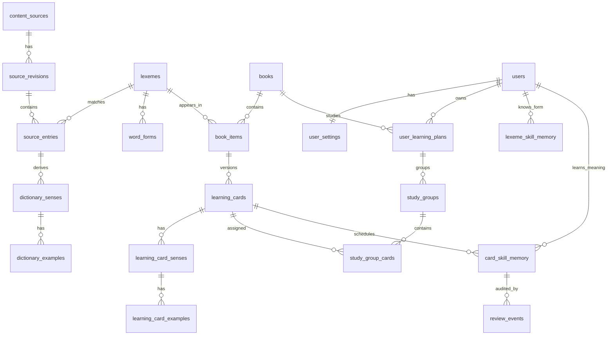

# WordFlip 数据库设计

> 版本：v2.0
> 日期：2026-07-16
> 状态：词书专属学习卡 + FSRS 全新基线
> 关联：[requirements.md](./requirements.md) · [api-modules.md](./api-modules.md) · [openapi.yaml](../../wordflip-api/openapi.yaml)

本设计对应空数据库上的全新 Flyway V1。旧数据库只做只读备份，不迁移用户进度，也不在新代码中保留旧表、双写或兼容接口。大批内容由幂等发布工具写入，不生成巨型 Flyway SQL。

## 1. 核心不变量

- 用户可保留多本词书和历史计划，但 `user_settings.active_plan_id` 只指向一个当前计划。
- 学习单位是 `learning_cards.id`，规范词形单位是 `lexemes.id`；API 同时返回 `cardId` 与 `lexemeId`。
- `(book_id, lexeme_id)` 在 `book_items` 中唯一。
- 每个词书条目最多一个当前发布版学习卡；发布卡至少有一个合格主义项。
- `card_skill_memory` 是 FSRS 调度真相；`lexeme_skill_memory` 不能直接使新卡变为掌握。
- 浏览和翻卡不写记忆；有效答题在同一事务写 `review_events` 并更新双层记忆。
- 用户导入释义只属于该用户的词书，不进入公共词汇资料。
- 来源原始记录不可被结构化清洗结果覆盖；所有派生义项均可追溯到来源修订和原始条目。

## 2. 关系概览

## 3. 内容来源与词汇资料

| 表 | 关键字段 | 约束与职责 |
|---|---|---|
| `content_sources` | `id`, `code`, `name`, `license_name`, `license_url`, `homepage_url` | `code` 唯一；描述 ECDICT、WordNet、词书原文或用户输入等来源 |
| `source_revisions` | `id`, `source_id`, `version`, `download_url`, `sha256`, `file_size`, `entry_count`, `manifest_json`, `verified_at` | `(source_id, version)` 唯一；固定可复现修订 |
| `lexemes` | `id`, `word_key`, `headword`, `language`, `phonetic`, `status` | `(language, word_key)` 唯一；`word_key=lower(trim(headword))` |
| `source_entries` | `id`, `revision_id`, `lexeme_id`, `source_key`, `raw_payload`, `raw_definition`, `raw_translation`, `match_status` | `(revision_id, source_key)` 唯一；保留原始字段，不做破坏性覆盖 |
| `dictionary_senses` | `id`, `source_entry_id`, `pos`, `cn`, `en_gloss`, `quality`, `sort_order`, `derivation_json` | 派生义项；`derivation_json` 记录规则、覆盖文件与原始片段 |
| `dictionary_examples` | `id`, `sense_id`, `en`, `cn`, `sort_order` | 例句隶属具体来源义项 |
| `word_forms` | `id`, `lexeme_id`, `form`, `form_key`, `form_type` | `(lexeme_id, form_key, form_type)` 唯一；保存复数、时态、变体等 |

完整 ECDICT SQLite 保留在离线内容目录；线上 MySQL 只发布首批三本词书实际涉及的 `lexemes/source_entries/dictionary_*`。

## 4. 词书与学习卡

| 表 | 关键字段 | 约束与职责 |
|---|---|---|
| `books` | `id`, `owner_user_id`, `code`, `name`, `source_type`, `visibility`, `status`, `declared_count`, `published_card_count`, `content_version` | 公共词书 `owner_user_id` 为空；用户导入词书只能归属一个用户 |
| `book_items` | `id`, `book_id`, `lexeme_id`, `sort_order`, `raw_headword`, `raw_meaning`, `status`, `metadata_json` | `UNIQUE(book_id, lexeme_id)`；保存书内顺序与原始考义 |
| `learning_cards` | `id`, `book_item_id`, `version`, `status`, `published_at`, `created_by`, `review_note` | `UNIQUE(book_item_id, version)`；同一条目最多一个 `status='published'` |
| `learning_card_senses` | `id`, `card_id`, `source_sense_id`, `pos`, `cn`, `en_gloss`, `is_primary`, `quality`, `sort_order`, `provenance_json` | 发布卡至少一个 `quality='ok'`；恰好一个合格主义项 |
| `learning_card_examples` | `id`, `card_sense_id`, `source_example_id`, `en`, `cn`, `sort_order` | 卡片专属例句，可引用来源例句 |

`learning_cards.status` 使用 `draft/review_required/published/retired`。数据库用生成列或事务内唯一锁保证每个 `book_item` 只有一个发布版本；发布工具还会做完整性校验。

## 5. 用户、计划与分组

| 表 | 关键字段 | 约束与职责 |
|---|---|---|
| `users` | `id`, `email`, `phone`, `password_hash`, `status`, `timezone`, timestamps | 邮箱与手机号分别唯一 |
| `user_settings` | `user_id`, `active_plan_id`, `group_size`, `group_strategy`, `auto_speak`, `theme_mode`, `quiz_launch_mode`, `default_question_limit` | 每用户一行；`active_plan_id` 可空且必须属于该用户 |
| `user_learning_plans` | `id`, `user_id`, `book_id`, `status`, `daily_new_card_limit`, timestamps | `(user_id, book_id)` 可保留一条长期计划；切换只更新当前指针 |
| `study_groups` | `id`, `plan_id`, `name`, `source`, `sort_order`, timestamps | 分组严格属于一个学习计划 |
| `study_group_cards` | `id`, `group_id`, `plan_id`, `card_id`, `sort_order`, `added_at` | `UNIQUE(plan_id, card_id)`，确保当前计划内一卡一组 |

切换当前计划必须锁定 `user_settings`，校验计划归属后原子更新 `active_plan_id`。旧计划、分组和进度不删除。

## 6. 双层 FSRS 记忆与审计

`skill` 固定为 `dictation/choice`；`state` 固定为 `new/learning/review/relearning`。

| 表 | 关键字段 | 约束与职责 |
|---|---|---|
| `lexeme_skill_memory` | `id`, `user_id`, `lexeme_id`, `skill`, `familiarity`, `last_review_at`, `successful_reviews`, `failed_reviews`, `version` | `UNIQUE(user_id, lexeme_id, skill)`；跨书诊断参考 |
| `card_skill_memory` | `id`, `user_id`, `card_id`, `skill`, `state`, `step`, `stability`, `difficulty`, `due_at`, `last_review_at`, `reps`, `lapses`, `elapsed_days`, `scheduled_days`, `fsrs_version`, `version` | `UNIQUE(user_id, card_id, skill)`；乐观锁 `version`；权威调度状态 |
| `review_events` | `id`, `user_id`, `plan_id`, `card_id`, `lexeme_id`, `skill`, `question_type`, `rating`, `correct`, `answered_at`, `old_state_json`, `new_state_json`, `fsrs_version`, `request_id` | `request_id` 唯一防重；评分仅 `again/good`；不可变审计日志 |

判题事务顺序：

1. 校验会话、题目、当前计划和 `cardId/lexemeId` 快照。
2. 锁定或创建 `card_skill_memory` 与 `lexeme_skill_memory`。
3. 服务端把错误映射 `Again`、正确映射 `Good`，调用锁定版本 FSRS。
4. 插入包含旧/新状态的 `review_events`。
5. 更新双层记忆并提交；任何一步失败则全部回滚。

默认配置：目标保持率 `0.90`，最大间隔 `36500` 天，官方默认权重，首版不做个人参数训练。

## 7. 测验、媒体、统计与成就

| 表 | 关键字段 | 约束与职责 |
|---|---|---|
| `quiz_sessions` | `id` UUID, `user_id`, `plan_id`, `status`, `source`, `question_count`, `score`, timestamps | 会话固定到创建时的学习计划 |
| `quiz_questions` | `id`, `session_id`, `card_id`, `lexeme_id`, `skill`, `question_type`, `prompt_json`, `answer_json`, `sort_order` | `(session_id, sort_order)` 唯一；保存不可变题面快照 |
| `quiz_answers` | `id`, `session_id`, `question_id`, `user_id`, `answer_json`, `correct`, `review_event_id`, `answered_at` | `question_id` 唯一，防重复作答 |
| `card_images` | `id`, `user_id`, `card_id`, `storage_key`, `transform_json`, timestamps | `UNIQUE(user_id, card_id)` |
| `card_stains` | `id`, `user_id`, `card_id`, `hidden`, `config_json`, timestamps | `UNIQUE(user_id, card_id)` |
| `study_logs` | `id`, `user_id`, `plan_id`, `group_id`, `log_date`, `duration_sec`, `cards_viewed`, `quiz_count` | 按用户日历日统计；浏览日志不改记忆 |
| `achievement_definitions` | `id`, `code`, `name`, `rule_json`, `enabled` | 成就定义 |
| `user_achievements` | `id`, `user_id`, `achievement_id`, `plan_id`, `unlocked_at`, `snapshot_json` | `(user_id, achievement_id, plan_id)` 唯一 |

## 8. 索引与查询

- `card_skill_memory(user_id, due_at, card_id)`：当前用户到期队列。
- `study_group_cards(plan_id, group_id, sort_order)`：当前计划分组卡片。
- `learning_cards(book_item_id, status)` 与 `book_items(book_id, sort_order)`：词书发布卡读取。
- `source_entries(lexeme_id, revision_id)`：详情来源展开。
- `review_events(user_id, card_id, skill, answered_at)`：审计与统计。
- `quiz_sessions(user_id, created_at)`、`study_logs(user_id, log_date)`：今日与统计。

## 9. 内容发布与 Flyway

- Flyway 新目录只含结构、少量系统枚举与必要成就定义；首个文件为全新 `V1__init_wordflip_v2.sql`。
- ECDICT manifest 固定版本、许可、下载地址、SHA-256、文件大小与词条数。
- 内容管线命令为 `download`、`verify`、`build`、`publish`；`publish` 以来源修订、词书 code、条目和卡片版本作为幂等键。
- 只有 `published` 卡片进入 App；异常项不得静默发布。
- 上线前执行旧 MySQL 备份，再创建空数据库、运行 V1、发布三本词书内容并做冒烟测试。

## 10. 明确废弃

新基线不包含 `dictionaries`、`dict_words`、`dict_senses`、`book_words`、`user_book_selection`、`user_word_lexicon`、`groups`、`group_words`、`word_mastery`、`review_plans`、`word_skill_progress` 及任何 `active_dict_id`。旧表只存在于只读备份和历史迁移目录。
