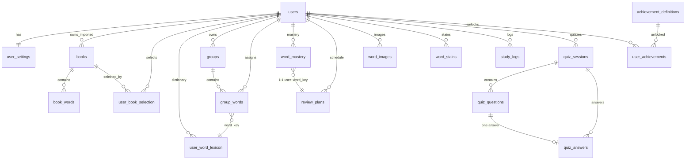

# WordFlip 数据库设计

> 版本：v1.0  
> 日期：2026-06-30  
> 状态：**已定稿（MVP）**  
> 关联：[requirements.md](./requirements.md) · [architecture.md](./architecture.md) · [api-modules.md](./api-modules.md) · [openapi.yaml](../../wordflip-api/openapi.yaml)

本文档为 WordFlip MVP 的 **MySQL 8 逻辑模型** 与 **Redis 辅助存储** 设计。业务规则以 `requirements.md` / `api-modules.md` / `openapi.yaml` 为准；Flyway 脚本 `V1__init_schema.sql` 应与本设计一一对应。

---

## 1. 设计原则

| 原则 | 说明 |
|------|------|
| 服务端权威 | 掌握度、SRS、分组增量规则仅存 MySQL，Redis 仅缓存/会话 |
| 用户域 wordKey | `word_key = LOWER(TRIM(en))`；学习进度、图片、污渍、掌握度均绑定 `(user_id, word_key)` |
| 一词一组 | `group_words.UNIQUE(user_id, word_key)` |
| 掌握度仅测验写 | 无 `word_mastery` 的手动 PATCH；仅 `applyQuizResult` 事务写入 |
| 分组增量追加 | `PUT /settings` 只 INSERT 新组，不 DELETE/重建已有 `groups` |
| 勾选与入组解耦 | 取消勾选词书 **不** 删除 `group_words` |
| InnoDB + utf8mb4 | 字符集 `utf8mb4_unicode_ci`；主键 `BIGINT UNSIGNED`（雪花或自增，全库统一） |
| 时区 | 服务端 DATETIME 存 UTC；`next_review_at` 用 **DATE**（用户日历日）；「当日」由 `users.timezone` 或 `X-Timezone` 决定 |

---

## 2. 模块划分与表映射

与 [api-modules.md](./api-modules.md) 模块一一对应：

| 模块 | Service | 表（MySQL） | Redis |
|------|---------|-------------|-------|
| **Auth** | AuthService | `users` | Refresh Token、黑名单、登录限流 |
| **Settings** | SettingsService | `user_settings` | — |
| **Books** | BookService, BookImportService | `books`, `book_words`, `user_book_selection` | 导入 preview payload、导入限流 |
| **Words** | GroupService | `book_words`, `user_book_selection`, `group_words`, `user_word_lexicon` | — |
| **Groups** | GroupService | `groups`, `group_words` | — |
| **Study** | StudyService | `groups`, `group_words`, `user_word_lexicon`, `word_learning_state`* | — |
| **Today** | ReviewService | `group_words`, `word_learning_state`, `word_mastery`, `review_plans` | `today:{userId}:{yyyyMMdd}` |
| **Quiz** | QuizService → ReviewService | `quiz_sessions`, `quiz_questions`, `quiz_answers`, `word_mastery`, `review_plans` | — |
| **Images** | ImageService | `word_images` | — |
| **Stains** | StainService | `word_stains` | — |
| **Stats** | StatsService | `study_logs`, `achievement_definitions`, `user_achievements`, `quiz_answers` | 可选 stats 缓存 |

\* Study 读取掌握度时 JOIN `word_mastery` + `review_plans`（或下文合并视图）。

### 2.1 表清单（22 张）

```
【Auth / Settings】  users, user_settings
【Books / Lexicon】   books, book_words, user_book_selection, user_word_lexicon
【Groups】           groups, group_words
【SRS / Quiz】       word_mastery, review_plans, quiz_sessions, quiz_questions, quiz_answers
【Media】            word_images, word_stains
【Stats】            study_logs, achievement_definitions, user_achievements
【Import 可选】      book_import_previews（MVP 主用 Redis）
```

---

## 3. 总体 ER 图



---

## 4. 全局约定

### 4.1 命名与类型

| 项 | 约定 |
|----|------|
| 表名 | 小写蛇形复数 |
| 主键 | `id BIGINT UNSIGNED` |
| 时间 | `DATETIME(3)` UTC；业务日期 `DATE` |
| JSON | `transform_json`, `detail_json`, `stain_config_json` |
| 枚举 | MySQL `ENUM` 或 `VARCHAR` + CHECK（Flyway 任选） |
| `word_key` | `VARCHAR(191)`（utf8mb4 索引字节上限） |

### 4.2 核心不变量

| ID | 不变量 |  enforcement |
|----|--------|--------------|
| I1 | `word_key = normalize(en)` | 应用层写入校验 |
| I2 | 一书内词条唯一 | `uk_book_words_book_key` |
| I3 | 用户一词一组 | `uk_group_words_user_word` |
| I4 | `group_words.user_id = groups.user_id` | Service 单事务 + 可选 TRIGGER |
| I5 | PUT /settings 只 append | GroupService 禁止删旧组 |
| I6 | 取消勾选不撤词 | 无 DELETE group_words on deselect |
| I7 | distinct 词数跨书去重 | SQL DISTINCT，非 sum(word_count) |
| I8 | mastery 与 review 1:1 | 首次测验同事务 INSERT 两表 |
| I9 | `has_quiz_history` 不回退 | 首次答题后恒为 1 |
| I10 | 掌握度仅经测验 | 无 mastery 更新 API |

### 4.3 architecture.md 表名对照

| architecture.md | 本设计 | 说明 |
|-----------------|--------|------|
| `words` | **`book_words`** | 词书词条，语义更清晰 |
| `canonical_words` | **`user_word_lexicon`** | 用户学习域词典 |
| — | **`quiz_questions`** | 新增：会话题面快照 |
| — | **`achievement_definitions`** | 新增：成就定义 seed |

---

## 5. Auth / Settings 模块

### 5.1 `users`

| 列 | 类型 | NULL | 默认 | 说明 |
|----|------|------|------|------|
| `id` | BIGINT UNSIGNED | NO | — | PK |
| `email` | VARCHAR(255) | YES | NULL | 唯一（允许多 NULL） |
| `phone` | VARCHAR(20) | YES | NULL | E.164，唯一 |
| `password_hash` | VARCHAR(72) | NO | — | BCrypt |
| `status` | ENUM('active','disabled') | NO | active | |
| `timezone` | VARCHAR(64) | NO | Asia/Shanghai | 用户默认时区 |
| `created_at` | DATETIME(3) | NO | CURRENT_TIMESTAMP(3) | |
| `updated_at` | DATETIME(3) | NO | ON UPDATE | |
| `last_login_at` | DATETIME(3) | YES | NULL | |

**索引：** `PRIMARY KEY (id)` · `UNIQUE uk_users_email (email)` · `UNIQUE uk_users_phone (phone)`

**约束：** `email IS NOT NULL OR phone IS NOT NULL`（CHECK 或应用层）

### 5.2 `user_settings`

| 列 | 类型 | NULL | 默认 | 说明 |
|----|------|------|------|------|
| `user_id` | BIGINT UNSIGNED | NO | — | PK，FK → users |
| `group_size` | TINYINT UNSIGNED | NO | 20 | 10/20/30/50 |
| `group_strategy` | ENUM('book_order','frequency','random') | NO | book_order | REQ-BOOK-22~24 |
| `auto_speak` | TINYINT(1) | NO | 1 | REQ-SETTINGS-1 |
| `theme_mode` | ENUM('system','light','dark') | NO | system | REQ-SETTINGS-7 |
| `study_guide_completed` | TINYINT(1) | NO | 0 | REQ-STUDY-23 |
| `reminder_enabled` | TINYINT(1) | NO | 0 | 规划项占位 |
| `review_reminder_enabled` | TINYINT(1) | NO | 0 | 规划项占位 |
| `updated_at` | DATETIME(3) | NO | ON UPDATE | |

**FK：** `user_id → users(id) ON DELETE CASCADE`

**生命周期：** 注册成功时同事务 INSERT 默认行。

---

## 6. Books / Lexicon 模块

### 6.1 `books`

| 列 | 类型 | NULL | 默认 | 说明 |
|----|------|------|------|------|
| `id` | BIGINT UNSIGNED | NO | — | PK |
| `source` | ENUM('builtin','imported') | NO | — | |
| `user_id` | BIGINT UNSIGNED | YES | NULL | imported 必填；builtin 为 NULL |
| `name` | VARCHAR(64) | NO | — | |
| `declared_count` | INT UNSIGNED | YES | NULL | 内置「约 3000 词」展示 |
| `word_count` | INT UNSIGNED | NO | 0 | 该书去重后词条数（冗余维护） |
| `created_at` | DATETIME(3) | NO | CURRENT_TIMESTAMP(3) | |
| `updated_at` | DATETIME(3) | NO | ON UPDATE | |

**索引：** `UNIQUE uk_books_user_name (user_id, name)`（imported 同名 → 409）· `idx_books_source`

**CHECK：** `(source='builtin' AND user_id IS NULL) OR (source='imported' AND user_id IS NOT NULL)`

### 6.2 `book_words`

词书内词条（architecture 原 `words` 表）。

| 列 | 类型 | NULL | 默认 | 说明 |
|----|------|------|------|------|
| `id` | BIGINT UNSIGNED | NO | — | PK |
| `book_id` | BIGINT UNSIGNED | NO | — | FK → books |
| `word_key` | VARCHAR(191) | NO | — | normalize(en) |
| `en` | VARCHAR(191) | NO | — | 展示原文 |
| `cn` | VARCHAR(512) | NO | — | |
| `pos` | VARCHAR(32) | YES | NULL | |
| `ph` | VARCHAR(64) | YES | NULL | |
| `detail_json` | JSON | YES | NULL | 例句、词根（REQ-STUDY 抽屉） |
| `sort_order` | INT UNSIGNED | NO | 0 | 书内顺序 |
| `created_at` | DATETIME(3) | NO | CURRENT_TIMESTAMP(3) | |

**索引：** `UNIQUE uk_book_words_book_key (book_id, word_key)` · `idx_book_words_word_key (word_key)`

**FK：** `book_id → books(id) ON DELETE CASCADE`

### 6.2.1 `word_freq_ranks`

全局英文词频序（`GroupStrategy.frequency`）；与词书无关，按 `word_key` 查 rank。

| 列 | 类型 | NULL | 默认 | 说明 |
|----|------|------|------|------|
| `word_key` | VARCHAR(128) | NO | — | PK；normalize(en) |
| `freq_rank` | INT UNSIGNED | NO | — | 1=最高频（wordfreq/COCA） |
| `source` | VARCHAR(32) | NO | wordfreq | 语料标识 |

**索引：** `PRIMARY KEY (word_key)` · `idx_word_freq_ranks_rank (freq_rank)`

**分组逻辑：** 合并去重后按 `freq_rank ASC` 排序；无 rank 的词排末尾，保持 book_order 相对序（REQ-BOOK-24）。

### 6.3 `user_book_selection`

持久化 `PUT /settings` 的 `bookIds`（存在即选中）。

| 列 | 类型 | NULL | 默认 | 说明 |
|----|------|------|------|------|
| `user_id` | BIGINT UNSIGNED | NO | — | |
| `book_id` | BIGINT UNSIGNED | NO | — | |
| `selected_at` | DATETIME(3) | NO | CURRENT_TIMESTAMP(3) | |

**PK：** `(user_id, book_id)`

**写入：** `PUT /settings` 全量替换（DELETE 不在列表 + INSERT 新增）。

**去重词数查询：**

```sql
SELECT COUNT(DISTINCT bw.word_key)
FROM user_book_selection ubs
JOIN book_words bw ON bw.book_id = ubs.book_id
WHERE ubs.user_id = :userId;
```

### 6.4 `user_word_lexicon`

用户学习域词典：测验判题、卡片展示、图片/污渍绑定的 **cn/en 真相来源**。

| 列 | 类型 | NULL | 默认 | 说明 |
|----|------|------|------|------|
| `id` | BIGINT UNSIGNED | NO | — | PK |
| `user_id` | BIGINT UNSIGNED | NO | — | FK → users |
| `word_key` | VARCHAR(191) | NO | — | |
| `en` | VARCHAR(191) | NO | — | 判题标准英文 |
| `cn` | VARCHAR(512) | NO | — | |
| `pos` | VARCHAR(32) | YES | NULL | |
| `ph` | VARCHAR(64) | YES | NULL | |
| `detail_json` | JSON | YES | NULL | |
| `source_book_id` | BIGINT UNSIGNED | YES | NULL | 首次来源书 |
| `updated_at` | DATETIME(3) | NO | ON UPDATE | |

**索引：** `UNIQUE uk_lexicon_user_word (user_id, word_key)`

**Upsert 时机：**

1. `POST /books/import` confirm — 批量 upsert 该书词条  
2. `PUT /settings` append 前 — 对 delta wordKeys upsert  
3. `POST /groups/custom` — 对选中 keys upsert  

**合并策略（定稿）：** 已存在 `(user_id, word_key)` **不覆盖** cn/en（保留首次学习语义）；导入 confirm 仅插入新 key。

### 6.5 导入 Preview（Redis 为主）

| 存储 | Key | TTL | 内容 |
|------|-----|-----|------|
| Redis | `import:preview:{token}` | 15min | `{ userId, suggestedName, words[], deduplicatedCount }` |

**可选表 `book_import_previews`**（审计/Redis 降级）：

| 列 | 类型 | 说明 |
|----|------|------|
| `token` | CHAR(36) | PK |
| `user_id` | BIGINT | FK |
| `suggested_name` | VARCHAR(64) | |
| `payload_json` | JSON | 解析结果 |
| `expires_at` | DATETIME(3) | |
| `consumed_at` | DATETIME(3) | confirm 后标记 |

**Confirm 流程：** INSERT `books` + bulk `book_words` + `user_book_selection` + upsert `user_word_lexicon`；**不**自动 append groups。

---

## 7. Groups 模块

### 7.1 `groups`

| 列 | 类型 | NULL | 默认 | 说明 |
|----|------|------|------|------|
| `id` | BIGINT UNSIGNED | NO | — | PK |
| `user_id` | BIGINT UNSIGNED | NO | — | FK → users |
| `name` | VARCHAR(64) | NO | — | auto:「第 N 组」；custom 可命名 |
| `source` | ENUM('auto','custom') | NO | — | |
| `status` | ENUM('not_started','learning','completed') | NO | not_started | 可运行时聚合回写 |
| `sort_order` | INT UNSIGNED | NO | 0 | |
| `created_at` | DATETIME(3) | NO | CURRENT_TIMESTAMP(3) | |

**索引：** `idx_groups_user_created (user_id, created_at)` · `idx_groups_user_source (user_id, source)`

### 7.2 `group_words`

| 列 | 类型 | NULL | 默认 | 说明 |
|----|------|------|------|------|
| `id` | BIGINT UNSIGNED | NO | — | PK |
| `user_id` | BIGINT UNSIGNED | NO | — | **冗余**，支撑 UNIQUE |
| `group_id` | BIGINT UNSIGNED | NO | — | FK → groups |
| `word_key` | VARCHAR(191) | NO | — | |
| `sort_order` | INT UNSIGNED | NO | 0 | |
| `created_at` | DATETIME(3) | NO | CURRENT_TIMESTAMP(3) | |

**索引：**

```sql
UNIQUE uk_group_words_user_word (user_id, word_key)   -- 一词一组 ★
UNIQUE uk_group_words_group_word (group_id, word_key)
KEY idx_group_words_group_sort (group_id, sort_order)
```

**增量 append 伪代码：**

```
delta = DISTINCT word_key FROM selected_books
        MINUS word_key FROM group_words WHERE user_id=?
ORDER BY word_key ASC   -- 确定性切分，保证幂等
→ 按 group_size 切分 → INSERT groups + group_words
```

**`groups.status` / `progress`：** MVP 推荐 **查询时聚合**（JOIN mastery），避免双写；列表 API 可缓存。

**progress 公式：** `COUNT(level='unlearned' AND has_quiz_history=1) / COUNT(*)` per group。

---

## 8. SRS / Quiz 模块

### 8.1 设计决策：`word_mastery` + `review_plans` 拆分

| 方案 | 结论 |
|------|------|
| 拆分（采用） | 与 architecture 一致；`word_mastery`=语义状态，`review_plans`=调度 |
| 合并单表 | 查询更简单，但偏离架构；若性能瓶颈可合并后保留 VIEW |

**1:1 强制：** 首次测验答题 **同事务** INSERT 两表；之后 `applyQuizResult` 同事务 UPDATE。

### 8.2 `word_mastery`

| 列 | 类型 | NULL | 默认 | 说明 |
|----|------|------|------|------|
| `id` | BIGINT UNSIGNED | NO | — | PK |
| `user_id` | BIGINT UNSIGNED | NO | — | |
| `word_key` | VARCHAR(191) | NO | — | |
| `level` | ENUM('unlearned','fuzzy','unknown') | NO | unlearned | 三态 |
| `has_quiz_history` | TINYINT(1) | NO | 0 | 首次答题后恒 1 |
| `first_quiz_at` | DATETIME(3) | YES | NULL | |
| `updated_at` | DATETIME(3) | NO | ON UPDATE | |

**索引：**

```sql
UNIQUE uk_wm_user_word (user_id, word_key)
KEY idx_wm_new_words (user_id, level, has_quiz_history)
KEY idx_wm_quiz_pool (user_id, level)
```

**无行语义（API 层）：** `level=unlearned`, `hasQuizHistory=false`, `stage=0`, `nextReviewAt=null`

### 8.3 `review_plans`

| 列 | 类型 | NULL | 默认 | 说明 |
|----|------|------|------|------|
| `id` | BIGINT UNSIGNED | NO | — | PK |
| `user_id` | BIGINT UNSIGNED | NO | — | |
| `word_key` | VARCHAR(191) | NO | — | |
| `stage` | TINYINT UNSIGNED | NO | 0 | 0..5，对应 INTERVALS 下标 |
| `next_review_at` | DATE | YES | NULL | 用户日历日 |
| `last_quiz_at` | DATETIME(3) | YES | NULL | |
| `updated_at` | DATETIME(3) | NO | ON UPDATE | |

**索引：**

```sql
UNIQUE uk_rp_user_word (user_id, word_key)
KEY idx_rp_due (user_id, next_review_at)
KEY idx_rp_mastered (user_id, stage, next_review_at)
```

### 8.4 applyQuizResult 状态机（定稿）

`INTERVALS = [1, 2, 4, 7, 15, 30]`（天）

| 条件 | level | stage | next_review_at |
|------|-------|-------|----------------|
| 答对 | unlearned | min(stage+1, 5) | 用户时区**当日结束**对应日历日 + INTERVALS[newStage] |
| 答错（非连续第2次） | fuzzy | max(stage-1, 0) | 当日 + **1** 天 |
| 连续第2次答错 | unknown | 0 | **当日**（DATE，优先复习） |

**连续判定：** 写入本条 `quiz_answers` **之前**：

```sql
SELECT correct FROM quiz_answers
WHERE user_id=? AND word_key=?
ORDER BY answered_at DESC, id DESC LIMIT 1;
```

若存在且 `correct=0` → 本次答错 → `unknown`。

**已掌握统计（闭合 paradox）：**

stage=5 时 `next_review_at` 常为 `today+30`，严格 `>` 永远无法满足。定稿：

```sql
stage >= 5 AND DATEDIFF(next_review_at, :today) >= 30
```

（需同步修订 openapi 中 `> today + 30d` 为 `>=`。）

### 8.5 `quiz_sessions`

| 列 | 类型 | NULL | 默认 | 说明 |
|----|------|------|------|------|
| `id` | CHAR(36) | NO | — | PK，UUID |
| `user_id` | BIGINT UNSIGNED | NO | — | |
| `source` | ENUM('today','study','retry') | NO | today | |
| `group_id` | BIGINT UNSIGNED | YES | NULL | study 源过滤 |
| `status` | ENUM('in_progress','completed') | NO | in_progress | |
| `question_limit` | INT | NO | 10 | |
| `total_questions` | INT | NO | — | 实际出题数 |
| `current_index` | INT | NO | 0 | |
| `score` | INT | NO | 0 | 答对数 |
| `started_at` | DATETIME(3) | NO | — | |
| `completed_at` | DATETIME(3) | YES | NULL | |

**索引：** `idx_qs_user_started (user_id, started_at DESC)` · `idx_qs_user_status (user_id, status)`

### 8.6 `quiz_questions`（会话题面）

创建 session 时写入；支持 409 防重复题号。

| 列 | 类型 | NULL | 说明 |
|----|------|------|------|
| `id` | BIGINT UNSIGNED | NO | PK |
| `session_id` | CHAR(36) | NO | FK → quiz_sessions |
| `question_index` | INT | NO | 与 API 一致（0-based） |
| `word_key` | VARCHAR(191) | NO | 同 session 内 DISTINCT |
| `expected_en` | VARCHAR(191) | NO | 判题快照 |
| `prompt_cn` | VARCHAR(512) | NO | |
| `prompt_pos` | VARCHAR(32) | YES | |
| `prompt_ph` | VARCHAR(64) | YES | |

**索引：** `UNIQUE uk_qq_session_index (session_id, question_index)`

### 8.7 `quiz_answers`

| 列 | 类型 | NULL | 说明 |
|----|------|------|------|
| `id` | BIGINT UNSIGNED | NO | PK，单调递增 |
| `user_id` | BIGINT UNSIGNED | NO | 冗余，连续错题查询 |
| `session_id` | CHAR(36) | NO | FK |
| `question_id` | BIGINT UNSIGNED | NO | FK → quiz_questions |
| `word_key` | VARCHAR(191) | NO | |
| `question_index` | INT | NO | |
| `user_answer` | VARCHAR(512) | NO | trim 后存储 |
| `correct` | TINYINT(1) | NO | |
| `is_consecutive_wrong` | TINYINT(1) | NO | 0 | 审计：是否触发 unknown |
| `answered_at` | DATETIME(3) | NO | |

**索引：**

```sql
UNIQUE uk_qa_session_index (session_id, question_index)
KEY idx_qa_user_word_time (user_id, word_key, answered_at DESC, id DESC)  -- 连续错题 ★
KEY idx_qa_user_time (user_id, answered_at DESC)
```

### 8.8 applyQuizResult 事务顺序

```
BEGIN;
  1. SELECT last correct FROM quiz_answers (连续错题)
  2. 计算 newLevel, newStage, newNextReviewAt
  3. INSERT quiz_answers
  4. UPSERT word_mastery (has_quiz_history=1)
  5. UPSERT review_plans
  6. UPDATE quiz_sessions
COMMIT;
→ DEL Redis today:{userId}:{yyyyMMdd}
→ IF session completed: upsert study_logs
```

---

## 9. Media 模块

### 9.1 `word_images`

| 列 | 类型 | NULL | 说明 |
|----|------|------|------|
| `id` | BIGINT UNSIGNED | NO | PK |
| `user_id` | BIGINT UNSIGNED | NO | |
| `word_key` | VARCHAR(191) | NO | |
| `storage_key` | VARCHAR(512) | NO | MinIO：`card-images/{userId}/{wordKey}.webp` |
| `transform_json` | JSON | NO | rotate/scale/offset/showCn/filters |
| `created_at` | DATETIME(3) | NO | |
| `updated_at` | DATETIME(3) | NO | |

**索引：** `UNIQUE uk_wi_user_word (user_id, word_key)`

**MinIO：** Bucket `wordflip`；DELETE 图片时删对象 + 删行。

### 9.2 `word_stains`

| 列 | 类型 | NULL | 说明 |
|----|------|------|------|
| `id` | BIGINT UNSIGNED | NO | PK |
| `user_id` | BIGINT UNSIGNED | NO | |
| `word_key` | VARCHAR(191) | NO | |
| `hidden` | TINYINT(1) | NO | 0 | REQ-STAIN-5 |
| `stain_config_json` | JSON | YES | NULL | seed/mode/density/stains[] |
| `updated_at` | DATETIME(3) | NO | |

**索引：** `UNIQUE uk_ws_user_word (user_id, word_key)`

**默认 seed（无行时）：** `stableHash(userId + wordKey)`，不落库直至用户 regenerate。

---

## 10. Stats 模块

### 10.1 `study_logs`

每日学习聚合；热力图、打卡、连续天数的数据源。

| 列 | 类型 | NULL | 默认 | 说明 |
|----|------|------|------|------|
| `user_id` | BIGINT UNSIGNED | NO | — | |
| `log_date` | DATE | NO | — | 用户时区日历日 |
| `study_duration_sec` | INT UNSIGNED | NO | 0 | POST /study/sessions 累加 |
| `words_viewed` | INT UNSIGNED | NO | 0 | |
| `quiz_answered` | INT UNSIGNED | NO | 0 | 测验完成时累加 |
| `quiz_correct` | INT UNSIGNED | NO | 0 | |
| `activity_score` | INT UNSIGNED | NO | 0 | 热力图分级用（算法见下） |
| `updated_at` | DATETIME(3) | NO | ON UPDATE | |

**PK：** `(user_id, log_date)`

**写入：**

| 触发 | 行为 |
|------|------|
| `POST /study/sessions` | UPSERT 累加 duration、words_viewed |
| Quiz session completed | UPSERT 累加 quiz_answered、quiz_correct |

**activity_score（热力图 4 级，REQ-STATS-2）：**

```
score = words_viewed + quiz_answered * 2 + quiz_correct
level 0..3 由当日 score 四分位或固定阈值映射
```

**连续打卡 `streakDays`：**

```sql
-- 从 today 向前数 study_logs 中 activity_score>0 或 quiz_answered>0 的连续 log_date
```

### 10.2 `achievement_definitions` + `user_achievements`

| achievement_definitions | 说明 |
|-------------------------|------|
| `id` VARCHAR(64) PK | 如 `streak_7`, `mastered_100` |
| `name`, `description` | 展示文案 |
| `icon_key` | Material icon 名 |
| `rule_json` | 解锁规则（MVP 可硬编码在 Service） |
| `sort_order` | |

| user_achievements | 说明 |
|-------------------|------|
| `user_id`, `achievement_id` | PK |
| `unlocked_at` | DATETIME(3) |

**MVP：** `achievement_definitions` Flyway seed；`StatsService` 在读取时计算是否解锁并 lazy INSERT。

### 10.3 统计 API 数据来源

| 字段 | 来源 |
|------|------|
| masteredCount | `group_words` JOIN `review_plans`（§8.4 公式） |
| streakDays | `study_logs` 连续日 |
| quizAccuracy | `quiz_answers` 近 30 天 `SUM(correct)/COUNT(*)` |
| totalStudyDays | `COUNT(DISTINCT log_date) FROM study_logs WHERE activity_score>0` |
| heatmap | `study_logs` 近 N 月 |

---

## 11. Today 仪表盘关键查询

前提：`:today` = 用户时区 `DATE`；所有统计 **限定已入组** `group_words`。

### 11.1 新词（REQ-TODAY-9）

```sql
SELECT COUNT(*)
FROM group_words gw
LEFT JOIN word_mastery wm
  ON wm.user_id = gw.user_id AND wm.word_key = gw.word_key
WHERE gw.user_id = :userId
  AND (wm.id IS NULL OR (wm.level = 'unlearned' AND wm.has_quiz_history = 0));
```

### 11.2 到期复习（REQ-TODAY-10）

```sql
SELECT COUNT(*)
FROM group_words gw
INNER JOIN review_plans rp
  ON rp.user_id = gw.user_id AND rp.word_key = gw.word_key
WHERE gw.user_id = :userId
  AND rp.next_review_at IS NOT NULL AND rp.next_review_at <= :today;
-- 排序：FIELD(wm.level, 'unknown','fuzzy','unlearned'), rp.next_review_at
```

### 11.3 测验池（REQ-TODAY-11）

```sql
SELECT COUNT(DISTINCT gw.word_key)
FROM group_words gw
LEFT JOIN word_mastery wm ON ...
LEFT JOIN review_plans rp ON ...
WHERE gw.user_id = :userId
  AND ((rp.next_review_at IS NOT NULL AND rp.next_review_at <= :today)
    OR wm.level IN ('fuzzy', 'unknown'));
```

### 11.4 未入组词池

```sql
SELECT bw.word_key, uwl.en, uwl.cn, ...
FROM (
  SELECT DISTINCT bw.word_key
  FROM user_book_selection ubs
  JOIN book_words bw ON bw.book_id = ubs.book_id
  WHERE ubs.user_id = :userId
) sel
LEFT JOIN group_words gw ON gw.user_id = :userId AND gw.word_key = sel.word_key
JOIN user_word_lexicon uwl ON uwl.user_id = :userId AND uwl.word_key = sel.word_key
WHERE gw.id IS NULL;
```

---

## 12. Redis 使用（非 MySQL，但属数据架构）

| 用途 | Key | TTL | 失效 |
|------|-----|-----|------|
| Refresh Token | `refresh:{userId}:{tokenId}` | 7d | logout / 轮换 |
| Access 黑名单 | `bl:{jti}` | ≤ access 过期 | — |
| 今日仪表盘 | `today:{userId}:{yyyyMMdd}` | 10min | mastery/review 变更 |
| 词书列表 | `books:{userId}` | 1h | 导入/勾选变更 |
| 导入 preview | `import:preview:{token}` | 15min | confirm |
| 导入限流 | `rl:import:{userId}` | 1min | — |
| 登录限流 | `rl:login:{account}` | 1min | — |

**原则：** 掌握度、复习计划 **只持久化 MySQL**；Redis 故障降级直查库。

---

## 13. Flyway 迁移规划

```
db/migration/
├── V1__init_schema.sql           # 全表 + 索引 + CHECK
├── V2__seed_builtin_books.sql    # 三本内置词书 + achievement_definitions
└── V{n}__*.sql                   # 后续增量
```

**V1 建表顺序（满足 FK）：**

```
users → user_settings
books → book_words
users → user_book_selection, user_word_lexicon, groups
groups → group_words
users → word_mastery, review_plans, word_images, word_stains, study_logs
users → quiz_sessions → quiz_questions, quiz_answers
achievement_definitions → user_achievements
```

**Flyway 脚本注释规范（与 [coding-standards.md](./coding-standards.md) 一致）：**

- 每张表：`COMMENT='中文表说明'`
- 业务字段：列级 `COMMENT '中文说明'`
- 模块分区：脚本内 `--` 中文段落标题
- 在 Navicat / DBeaver 中可通过 `SHOW FULL COLUMNS FROM 表名` 查看

---

## 14. 子 agent 评审闭合项

| 议题 | 评审结论 | 定稿 |
|------|----------|------|
| `words` vs `book_words` | 语义混淆 | **`book_words`** |
| 是否需要 `user_word_lexicon` | quiz/image 需稳定 cn/en | **需要**；多书同词不覆盖 |
| mastery/review 拆或合 | 查询 JOIN vs 单表 upsert | **拆分** + 同事务；性能瓶颈再合并 |
| `quiz_questions` | OpenAPI 409 题号 | **新增表** |
| `group_words.user_id` 冗余 | MySQL UNIQUE 限制 | **保留冗余** + Service 校验 |
| delta 切分顺序 | 幂等性 | **`ORDER BY word_key ASC`** |
| import preview | Redis vs MySQL | **Redis 主** + 可选 DB 审计表 |
| 连续错题 | quiz_answers vs 反范式列 | **查 quiz_answers** + `idx_qa_user_word_time` |
| masteredCount `>` paradox | stage5 时 next=today+30 | **`DATEDIFF >= 30`** |
| unknown next_review_at | 文档分歧 | **当日 DATE** |
| achievements | v5 演示 | **definitions seed + user_achievements** |
| groups.status | 存 vs 算 | **MVP 查询时聚合** |
| unassigned 全量 | 分页 vs chips | **`?all=true` 上限 5000**（openapi 已定） |

---

## 15. 索引优先级（实现顺序）

1. `uk_group_words_user_word` — 一词一组  
2. `idx_qa_user_word_time` — 连续错题  
3. `idx_rp_due` / `idx_rp_mastered` — Today  
4. `uk_lexicon_user_word` — 展示/判题  
5. `uk_book_words_book_key` — 导入去重  
6. `study_logs PK (user_id, log_date)` — 热力图  

---

## 16. 修订记录

| 日期 | 版本 | 说明 |
|------|------|------|
| 2026-06-30 | v1.0 | 初版：22 表 + Redis + 评审闭合；对齐 openapi v1.0 / api-modules v1.1 |

---

## 17. 下一步

1. 生成 `wordflip-server/src/main/resources/db/migration/V1__init_schema.sql`  
2. 生成 `V2__seed_builtin_books.sql`  
3. 同步修订 openapi `masteredCount` 口径为 `DATEDIFF >= 30`  
4. 更新 `architecture.md` §5 指向本文档  
