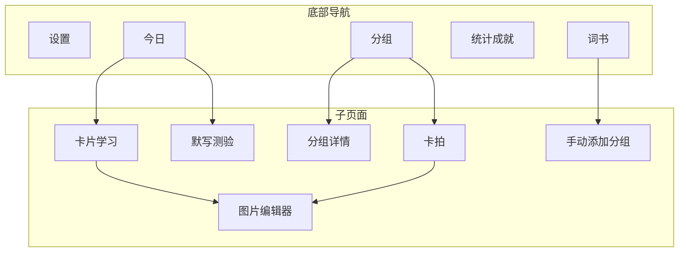
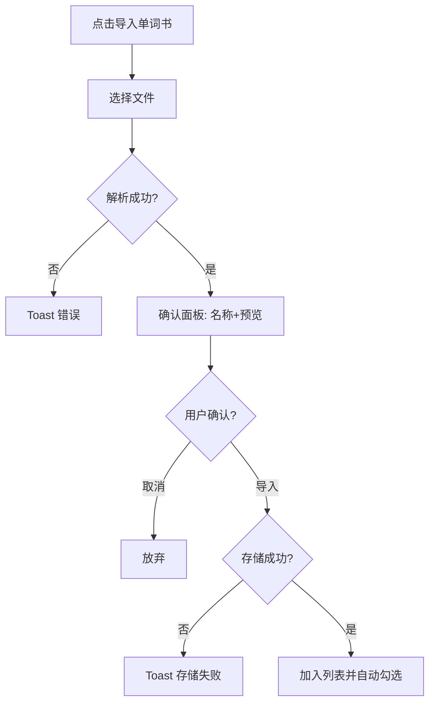
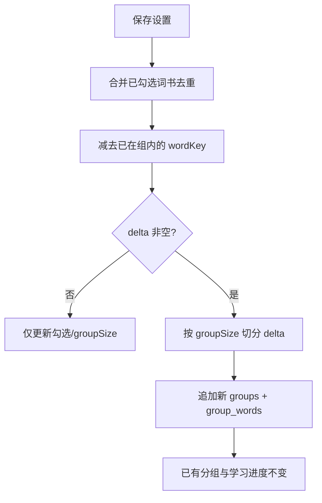
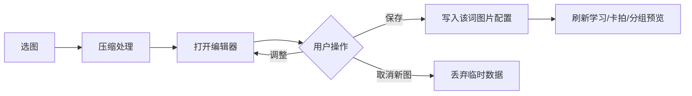

# WordFlip 单词卡片学习应用 — 需求规格说明

> 版本：v6（v5 原型 + 后端架构定稿补充）  
> 整理日期：2026-06-30  
> 文档性质：用户可见行为与业务逻辑规格，不含技术实现细节

本文档规定 WordFlip 从用户视角**必须做什么、在什么条件下做什么、如何反馈**。每条需求以 `REQ-<模块>-<序号>` 编号，便于追溯与拆分用户故事。

**需求来源优先级**：

1. 本文档 **v6 定稿**（掌握度三态、测验为准、分组增量追加、账号登录）  
2. `prototypes/wordflip-v5.html` 已实现交互（UI/动效参考）  
3. `docs/prd/WordFlip-PRD.md` 规划描述  

v5 原型与 v6 冲突时，以 **v6 业务定稿** 为准（尤其掌握度、分组生成、登录）；v5 独有 UI 交互仍以原型为准。

---

## 1. 产品概述与术语

### 1.1 产品定位

- **REQ-GLOBAL-1：** WordFlip 是一款移动端单词卡片学习应用，核心体验为「翻转卡片」：正面看英文，背面看中文释义或用户自定义图片，通过点击翻转、长按详情、默写测验等方式记忆单词。
- **REQ-GLOBAL-2：** 应用在手机尺寸容器内运行，主界面由底部五项导航与子页面栈组成，用户可在词书配置、分组学习、统计查看等功能间切换。
- **REQ-GLOBAL-3：** 应用支持多本词书合并学习；相同英文单词在多本词书中只计一次（去重后参与统计与选词）。

### 1.2 核心术语

| 术语 | 含义 |
|------|------|
| 词书 | 一组单词的集合，含内置词书与用户导入词书 |
| 分组 | 按词书设置切分或用户手动挑选形成的单词学习单元 |
| 掌握度（队列三态） | **未学习 / 模糊 / 不认识**；用于今日排队与薄弱角标；**仅测验写入**；按 skill（默写/选择）独立 |
| 稳定性权值 S | 记忆强度 `0.00–100.00`（小数）；组详情主展示为热力档；**仅测验写入**，学习翻卡不改；按 skill 独立 |
| 热力档 heatLevel | 由 S 映射的 0–4 档（新词→很熟），须 **颜色 + 文案**；展示档可由 `heatDisplayMode` 聚合 |
| skill（题型技能） | `dictation`（默写）与 `choice`（选择）双轨；各有独立三态 / S / SRS |
| 已掌握（统计） | 非用户可选状态：`S >= 80` 且最近测验成功且建议间隔 ≥ 30 天（见 REQ-EBBING-7） |
| 污渍 | 卡片正面英文面上的视觉记忆锚点标记 |
| 卡拍 | 为卡片背面拍摄或导入图片，形成图像化记忆 |
| 艾宾浩斯复习 | 按间隔重复安排到期复习的学习机制 |

### 1.3 信息架构

底部主导航（从左到右）：**设置 → 词书 → 分组 → 统计 → 今日**（今日为默认首页）。

子页面（通过前进/返回栈访问）：卡片学习、默写测验、分组详情、卡拍、手动添加分组；图片编辑器以全屏浮层形式覆盖当前页面。

---

## 2. 账号与登录

> 详述见 [user-design.md](./user-design.md)

- **REQ-AUTH-1：** MVP 必须登录后使用应用，不提供游客模式；未登录用户仅可访问登录/注册页。
- **REQ-AUTH-2：** 用户应可使用 **邮箱 + 密码** 或 **手机号 + 密码** 注册；邮箱与手机号至少填写一项。
- **REQ-AUTH-3：** 用户应可使用邮箱或手机号作为账号标识登录（统一账号输入框，系统自动识别类型）。
- **REQ-AUTH-4：** 注册或登录成功后，系统应进入「今日」主页，并加载该用户的学习数据。
- **REQ-AUTH-5：** 设置页应提供「退出登录」；退出后清除本地会话，返回登录页。
- **REQ-AUTH-6：** 登录失败时，系统应 Toast 或表单提示失败原因（不泄露账号是否存在）。

**规划项：** 短信验证码登录、找回密码、绑定第二登录方式。

---

## 3. 全局交互

### 3.1 页面导航

- **REQ-NAV-1：** 当用户点击底部导航任一项时，系统应切换到对应主页面，当前主页面滑出、新页面滑入，并清空子页面栈（此前进入的子页面不再保留）。
- **REQ-NAV-2：** 当用户从主页面或子页面通过「前进」操作进入子页面时，系统应将当前页面压入页面栈，新子页面从右侧滑入显示。
- **REQ-NAV-3：** 当用户在子页面点击返回按钮时，系统应从页面栈弹出上一页，当前页向右滑出，恢复上一页内容。
- **REQ-NAV-4：** 底部导航当前选中项应高亮显示（图标与文字强调），非选中项为默认样式。
- **REQ-NAV-5：** 子页面转场与主导航转场均应有约 0.3 秒的滑入滑出动画，使用户感知页面层级变化。

### 3.2 Toast 提示

- **REQ-TOAST-1：** 当系统需要向用户反馈轻量操作结果（保存成功、标记状态、错误提示等）时，应在底部导航栏上方居中显示 Toast 胶囊提示。
- **REQ-TOAST-2：** Toast 应在约 2 秒后自动消失，不阻塞用户继续操作。
- **REQ-TOAST-3：** Toast 文案应简短明确，说明操作结果或失败原因（如「设置已保存」「未识别到有效单词」「存储空间不足」）。

### 3.3 通用规则

- **REQ-NAV-6：** 当用户从任意入口进入默写测验页时，系统必须在页面展示前完成测验初始化（重新抽题、重置得分与进度），不得沿用上一次的测验状态。
- **REQ-NAV-7：** 当用户进入词书主页面时，系统应刷新词书列表、勾选状态与汇总信息，反映最近一次保存或导入结果。

---

## 4. 今日页（首页）

### 4.1 布局与内容

- **REQ-TODAY-1：** 今日页主内容区应在常见手机屏高下无需滚动即可展示核心信息；「开始学习」主按钮固定在底部导航栏正上方，不随列表滚动。
- **REQ-TODAY-2：** 顶部应展示问候语、当前日期（本地化格式，含星期）及连续打卡天数（火焰图标旁数字）。
- **REQ-TODAY-3：** 中部应展示三格统计：已掌握单词数、待复习单词数、学习完成度百分比，每格含数字与标签。
- **REQ-TODAY-4：** 「今日任务」区应展示三条任务行：**新词学习**、**到期复习**、**默写测验**；每行含图标、任务名称、说明（词书/分组来源与数量）及右侧数量。

### 4.2 任务计算规则

- **REQ-TODAY-9：** 「新词学习」数量 = 当前用户已入组、状态为 **未学习** 且尚未有过测验记录的单词数（可设每日上限，MVP 默认不限）。
- **REQ-TODAY-10：** 「到期复习」数量 = `next_review_at` 不晚于当日的单词数；排队优先级：**不认识 > 模糊 > 未学习（已到期）**。
- **REQ-TODAY-11：** 「默写测验」默认题目池 = 当日到期复习词 + 最近测验结果为模糊/不认识的词；具体抽题由服务端在初始化测验时决定。
- **REQ-TODAY-12：** 「已掌握单词数」为统计指标：`stability >= 80` 且最近测验成功且建议复习间隔 ≥ 30 天的单词数，**不是**用户可选的第四档状态。

### 4.3 跳转逻辑

- **REQ-TODAY-5：** 当用户点击「新词学习」或「到期复习」任务行时，系统应进入卡片学习子页面并加载当前推荐分组的学习内容。
- **REQ-TODAY-6：** 当用户点击「默写测验」任务行时，系统应进入默写测验子页面并完成测验初始化。
- **REQ-TODAY-7：** 当用户点击底部「开始学习」大按钮时，系统应进入卡片学习子页面，并展示当前推荐分组（含组名与待学词数说明）。
- **REQ-TODAY-8：** 当用户点击顶部提醒图标时，系统应以 Toast 等方式反馈提醒相关状态（具体提醒能力见设置页规划项）。
- **REQ-TODAY-13：** 今日页应展示「最近学习」分组列表（最多 3 条：组名 + 最近学习时间）；点击可进入该组学习或作为测验 `source=recent` 的词池来源。

---

## 5. 单词书页

### 5.1 内置词书选择

- **REQ-BOOK-1：** 单词书页应以卡片列表展示所有可选词书，包含 3 本内置词书：雅思核心词汇 3000、四级高频词汇、考研英语核心词。
- **REQ-BOOK-2：** 每本内置词书行应显示：图标、名称、声明词汇量（如 3000 词）、右侧勾选状态（✅ 已选 / ☐ 未选）。
- **REQ-BOOK-3：** 当用户点击某本词书行时，系统应切换该书的选中状态（选中 ↔ 取消），并立即更新底部汇总信息。
- **REQ-BOOK-4：** 词书支持多选；用户可同时勾选多本，也可全部取消（汇总为 0 词时仍允许保存，但自定义分组将无词可选）。

**规划项（未实现）：** 每本词书显示「已掌握数 / 总词汇数」学习进度（PRD 要求，v5 原型未展示）。

### 5.2 导入词书

- **REQ-BOOK-5：** 单词书页应提供「导入单词书」入口，说明支持 JSON、CSV、TXT 格式。
- **REQ-BOOK-6：** 当用户触发导入并选择文件后，系统应解析文件内容；支持格式包括：
  - **JSON**：`{"name":"词书名","words":[{"en":"...","cn":"...","pos":"...","ph":"..."}]}`，或纯单词对象数组；
  - **CSV/TXT**：每行 `单词,释义`、`单词;释义`、`单词|释义`、Tab 分隔、或 `单词 - 释义`；
  - 纯英文行（释义默认同单词）；以 `#` 或 `//` 开头的行及表头行（word/english/单词等）应忽略。
- **REQ-BOOK-7：** 解析成功后，系统应弹出确认面板，包含：可编辑的词书名称、前若干条单词预览、总词数提示。
- **REQ-BOOK-8：** 当用户在确认面板点击「导入」且名称非空时，系统应将词书写入本地存储、加入词书列表、自动勾选该书，并标注「已导入」；列表刷新后显示 Toast 成功及词数。
- **REQ-BOOK-9：** 当用户点击确认面板「取消」或点击遮罩关闭时，系统应放弃本次导入，不写入数据。
- **REQ-BOOK-10：** 当文件无法解析、无有效单词或存储失败时，系统应显示明确错误 Toast，不创建词书记录。
- **REQ-BOOK-11：** 导入词书行应提供删除按钮；当用户确认删除时，系统应移除该词书及其勾选状态，并刷新列表与汇总。

### 5.3 分组大小与汇总

- **REQ-BOOK-12：** 用户应可从预设分组大小中选择其一：10 / 20 / 30 / 50 词每组；当前选中项显示 ✅，其余为 ☐。
- **REQ-BOOK-13：** 当用户切换分组大小时，系统应立即重算并更新汇总文案：`已选 X 词（去重后）· 每组 N 词 · 共约 M 组`（M = ceil(X/N)，至少为 1）。**修改分组大小仅影响此后新追加的分组**，不拆分或合并已有分组。
- **REQ-BOOK-14：** 汇总词数 X = 当前已勾选词书合并后的 **真实 distinct 英文单词数**（英文小写去重）；内置词书按实际词条计数，声明词数仅作展示参考（如「约 3000 词」）。
- **REQ-BOOK-22：** 用户应可从三种自动分组策略中选择其一：**词书顺序**（`book_order`）、**词频**（`frequency`）、**随机**（`random`）；默认 **词书顺序**。
- **REQ-BOOK-23：** **词书顺序**策略下，系统应按用户当前勾选的词书顺序依次合并词条，书内按 `sort_order`；多书重复词 **保留首次出现** 的位置（去重保序）。
- **REQ-BOOK-24：** **随机**策略下，系统应对合并去重后的词表做 **稳定随机** 打乱（相同用户 + 相同词书勾选集合 → 相同顺序）；**词频**策略按 `word_freq_ranks` 全局 rank 升序排列；**无 rank 记录** 的词排在末尾并保持 book_order 相对顺序。
- **REQ-BOOK-27：** 词书页应提供分步向导：**增加书籍**（已保存词书锁定不可取消，仅追加新勾选）或 **重新分组**（可重选词书）→ 选择分组策略与大小 → 确认保存；Hub 页展示当前已选摘要，不提供平铺式混合保存。
- **REQ-BOOK-25：** 增量追加分组时，若最后一个 `source=auto` 分组未满 `groupSize`，应 **先补齐该组** 再按策略切分剩余 delta 创建新组；**不得**拆分或合并已有完整分组。
- **REQ-BOOK-26：** 用户可选择 **重新分组**（词书页显式操作，`PUT /settings` 传 `regroup=true`）：系统应 **删除该用户全部 auto 分组**（及其中 `group_words`），再按当前勾选词书、分组大小与分组策略 **全量重建** auto 组；**custom** 手动分组及其单词 **保留**；`word_mastery` / `review_plans` / 图片 / 污渍 **不删除**（单词再次入组时进度仍在）。

**规划项（未实现）：** 用户自定义输入任意分组大小（PRD 要求，v5 仅四档预设）。

### 5.4 保存、分组增量追加与自定义分组入口

- **REQ-BOOK-15：** 当用户点击「保存设置」时，系统应持久化词书勾选状态与分组大小，并 Toast「设置已保存」。
- **REQ-BOOK-17：** 保存设置时，系统应对 **尚未进入任何分组** 的单词（相对用户全部已勾选词书合并去重后的词表）按当前分组大小 **增量追加** 新分组；**不得删除或重建** 已有分组。
- **REQ-BOOK-18：** 增量追加时，已有分组内的单词、掌握度、复习计划、图片与污渍数据 **全部保留**；新分组内单词默认掌握度为 **未学习**。
- **REQ-BOOK-19：** 导入新书并勾选后保存设置，应仅在上述增量逻辑下追加包含新词的分组；与已有分组重复的单词（同英文）**不得**重复入组。
- **REQ-BOOK-20：** 取消勾选某词书时，已存在于分组中的单词 **仍保留** 在组内并继续参与学习（不自动移除）。
- **REQ-BOOK-21：** 每个英文单词在同一用户下 **只属于一个分组**（一词一组）。
- **REQ-BOOK-16：** 单词书页应提供「手动添加分组」入口；单词池为已勾选词书合并去重后、**且尚未入组** 的单词。

---

## 6. 手动添加分组

- **REQ-CG-1：** 手动添加分组页应展示说明文案：从尚未入组的单词中点选，组成自定义分组。
- **REQ-CG-2：** 页面应以可点击 chips 形式列出可选单词；点击切换选中（○ / ✓），顶部实时显示「已选 N 个」。
- **REQ-CG-3：** 当可选单词池为空时，系统应提示「无未入组单词；请先勾选词书并保存设置，或导入词书」，且不展示 chips。
- **REQ-CG-4：** 当用户点击「保存分组」且已选数量为 0 时，系统应 Toast「请先选择单词」，不关闭页面。
- **REQ-CG-5：** 当用户点击「保存分组」且已选数量 ≥ 1 时，系统应创建 **自定义分组**（`source=custom`）并写入分组列表，Toast 保存成功及词数，返回词书页；组内词默认 **未学习**。

---

## 7. 分组管理页

- **REQ-GROUP-1：** 分组管理页应展示分组列表（可按来源或创建时间区段）。
- **REQ-GROUP-2：** 每个分组卡片应展示：组名、状态标签（已完成 / 学习中 / 未开始）、热力分档统计（**heat0–heat4 / 总词**）、进度条（`stability >= 80` 占比，或按业务统计口径展示）。
- **REQ-GROUP-3：** 当用户点击分组卡片主体区域时，系统应进入该分组的详情子页面，默认以「单词掌握情况」列表模式打开。
- **REQ-GROUP-4：** 每个分组卡片应提供快捷按钮 **卡拍（📷）**：点击后进入卡拍子页面，标题为「卡拍 · {组名}」，展示该组全部单词的卡片网格。
- **REQ-GROUP-5：** 每个分组卡片应提供快捷按钮 **制作污渍（🎨）**：点击后进入分组详情子页面，并直接切换到污渍制作模式。

---

## 8. 分组详情页

### 8.1 列表模式（单词掌握情况）

- **REQ-GDETAIL-1：** 分组详情页顶栏应显示组名、返回按钮、污渍模式切换按钮（🎨）、开始学习按钮（▶）。
- **REQ-GDETAIL-2：** 列表模式下，页面应逐条展示组内单词：英文、中文释义、词性，以及 **稳定性热力**（heatLevel 色块 + 文案：新词/初识/巩固中/较熟/很熟）；若队列三态为模糊/不认识，可叠加薄弱角标。
- **REQ-GDETAIL-3：** 稳定性与队列三态 **以默写测验结果为最终依据**；列表模式 **不提供** 手动修改按钮（v5 的「记得/模糊」按钮在正式版中移除）。
- **REQ-GDETAIL-4：** 用户可通过列表进入学习或测验以更新状态；测验后热力与薄弱角标随服务端快照刷新。

### 8.2 污渍制作模式

- **REQ-GDETAIL-5：** 当用户点击污渍模式切换按钮时，系统应在「列表模式」与「污渍制作模式」间切换，同一分组上下文保持不变。
- **REQ-GDETAIL-6：** 污渍制作模式顶部应提供类型筛选：随机、咖啡、墨水、荧光、随机线条、蜡笔；支持多选，「随机」表示不限制类型。
- **REQ-GDETAIL-7：** 污渍制作模式应提供「一键生成所有污渍」按钮；点击后为组内每个单词生成新污渍（受当前类型筛选约束），并刷新预览网格。
- **REQ-GDETAIL-8：** 污渍制作模式应以卡片网格展示每张卡正面（含污渍与英文），用户可点击卡片翻转查看背面（含卡拍图片若有）。
- **REQ-GDETAIL-9：** 每张预览卡下方应提供「换一个」与「显示/隐藏」污渍按钮；操作后即时更新该词污渍状态，并同步至学习页与卡拍页正面。

### 8.3 开始学习

- **REQ-GDETAIL-10：** 当用户在分组详情页点击开始学习（▶）时，系统应进入卡片学习子页面并加载学习内容。

---

## 9. 卡片学习页（核心）

### 9.1 布局与卡片内容

- **REQ-STUDY-1：** 卡片学习页顶栏应显示返回、当前组标题、进入默写测验入口。
- **REQ-STUDY-2：** 工具栏应提供「打乱」与「全翻正面/全翻背面」两个按钮；全翻按钮文案随当前全局翻转状态切换。
- **REQ-STUDY-3：** 卡片网格列数应随容器宽度自适应（约 1–4 列）；单张卡片宽高比约为 3:4.2。
- **REQ-STUDY-4：** 卡片正面应展示：英文单词、词性、可选污渍（未隐藏时）、底部「翻转」提示。
- **REQ-STUDY-5：** 卡片背面分两种状态：
  - **无用户图片**：展示中文释义、音标、「翻转」提示；
  - **有用户图片**：展示用户编辑后的图片；可选底部中文 overlay 条；「翻转」提示。
- **REQ-STUDY-6：** 污渍仅显示在卡片正面，背面不显示污渍。

### 9.2 翻转与发音

- **REQ-STUDY-7：** 当用户点击某张卡片且详情抽屉未打开时，系统应切换该卡正/背面；已翻至背面须再次点击才能翻回正面。
- **REQ-STUDY-8：** 卡片翻转应使用带回弹感的动画；翻转过程应保持 3D 透视效果。
- **REQ-STUDY-9：** 当设置中「翻转时自动发音」为开启且用户将卡片翻到背面时，系统应朗读该词英文读音。
- **REQ-STUDY-10：** 翻转时系统可 Toast 展示音标字符串作为辅助反馈。

### 9.3 打乱与全翻

- **REQ-STUDY-11：** 当用户点击「打乱」时，各卡片应先随机飞出再随机飞入新位置，总时长约 0.9 秒；打乱过程中按钮应暂时禁用防重复触发。
- **REQ-STUDY-12：** 打乱完成后，每张卡片应保持打乱前的独立翻转状态（已翻面的仍翻面，未翻的仍正面）。
- **REQ-STUDY-13：** 当用户点击「全翻」时，系统应将所有卡片统一翻到背面或统一翻回正面，并 Toast 提示当前模式（看中文 / 看英文）。

### 9.4 长按详情抽屉（Bottom Sheet）

- **REQ-STUDY-14：** 当用户在某卡片上长按约 0.5 秒且手指移动不超过约 10px 时，系统应从底部弹出详情抽屉，并显示半透明遮罩。
- **REQ-STUDY-15：** 详情抽屉打开期间，点击卡片不应触发翻转。
- **REQ-STUDY-16：** 详情抽屉应展示：分音节显示的单词、发音控制区（语速减/加、当前倍速、朗读按钮）、音标、中文、词性、词义段落、例句列表（2–3 条或「暂无例句」）、词根词缀段落。
- **REQ-STUDY-17：** 当用户点击朗读按钮时，系统应朗读当前单词，并在朗读过程中对单词字母做流动高亮动画；语速可在 0.5x–2.0x 范围调节。
- **REQ-STUDY-18：** 详情抽屉应提供污渍操作：「换一个污渍」「关闭/隐藏污渍」；执行后更新该词污渍并刷新学习页卡片，抽屉可关闭。
- **REQ-STUDY-19：** 详情抽屉应提供「卡片照片」区块：
  - **拍照**：关闭抽屉后调起相机选图；
  - **相册**：关闭抽屉后调起相册选图；
  - **编辑照片**：仅当该词已有图片时可点，否则置灰；进入图片编辑器；
  - **图片上显示中文**：Toggle 开关，仅当有图时可开启；切换后立即刷新学习页该卡背面。
- **REQ-STUDY-20：** 当用户从拍照/相册选图完成后，系统应自动进入图片编辑器，**不在选图瞬间直接保存**。
- **REQ-STUDY-21：** 当用户点击遮罩或完成操作关闭抽屉时，系统应收起抽屉、恢复学习区滚动，并停止发音相关动画。

### 9.5 首次引导

- **REQ-STUDY-22：** 当用户首次进入卡片学习页且未完成过引导时，系统应显示浮层引导：「长按卡片查看详细释义」，并提供「知道了」按钮。
- **REQ-STUDY-23：** 当用户点击「知道了」后，系统应关闭引导且不再显示（状态持久化）。

- **REQ-STUDY-24：** 卡片学习页 **不提供** 手动标记掌握度；翻转浏览不直接改变三态，掌握度由测验更新。

---

## 10. 卡拍页

### 10.1 入口与布局

- **REQ-SNAPSHOT-1：** 卡拍页仅能从分组管理页某分组的「卡拍」快捷按钮进入；页标题为「卡拍 · {组名}」。
- **REQ-SNAPSHOT-2：** 页面顶部应展示操作提示：点击翻面、背面添加图片、有图时长按或点右上角菜单管理。
- **REQ-SNAPSHOT-3：** 卡拍页以固定 2 列网格展示组内每张单词卡片，卡片比例与学习页一致；正面为英文+污渍，背面为图片或占位态。

### 10.2 无图卡片交互

- **REQ-SNAPSHOT-4：** 无图卡片背面应显示「点击添加图片」占位（含中文释义提示），无图片内容。
- **REQ-SNAPSHOT-5：** 当用户点击无图卡片正面时，系统应将该卡翻到背面。
- **REQ-SNAPSHOT-6：** 当用户点击无图卡片背面时，系统应弹出底部操作表：**拍照**、**从相册选择**；选源后进入图片选择与编辑流程。

### 10.3 有图卡片交互

- **REQ-SNAPSHOT-7：** 有图卡片背面应展示已保存的用户图片及可选中文条；右上角显示「⋯」管理按钮。
- **REQ-SNAPSHOT-8：** 当用户点击有图卡片且当前显示背面时，系统应翻回正面（不在背面重复弹出选图）。
- **REQ-SNAPSHOT-9：** 当用户长按有图卡片约 0.5 秒，或点击「⋯」按钮时，系统应弹出管理菜单：**编辑图片**、**更换图片**、**显示/隐藏中文**、**清除图片**。
- **REQ-SNAPSHOT-10：** 「更换图片」应重新走拍照/相册选图流程；「清除图片」应移除该词图片数据并刷新卡片为无图占位态。

### 10.4 与学习页一致性

- **REQ-SNAPSHOT-11：** 同一单词的卡片图片在学习页背面、卡拍页背面、图片编辑器预览中的位置、缩放、旋转、滤镜、中文条显示状态应完全一致（保存后各处同步更新）。

---

## 11. 图片编辑器

### 11.1 触发与总体流程

- **REQ-IMAGE-1：** 图片编辑器可在以下场景打开：卡拍页选图后、学习页详情抽屉拍照/相册后、卡拍/学习管理菜单「编辑图片」。
- **REQ-IMAGE-2：** 核心流程为：**选择图片 → 进入编辑器预览与调整 → 用户点击「保存到卡片」后才写入**；若用户取消且本次为新选图片未保存过，应丢弃临时图片不写入。
- **REQ-IMAGE-3：** 编辑器顶栏应显示关闭（取消）、标题（含当前单词）、重置按钮；底栏为「取消」与「保存到卡片」。

### 11.2 预览区

- **REQ-IMAGE-4：** 预览区应使用与学习卡片背面相同的结构与宽高比，默认展示卡片背面（图片 + 可选中文条）。
- **REQ-IMAGE-5：** 预览区应显示虚线框标示卡片实际边界，背景与卡片区域对比明显，便于用户辨认裁切范围。
- **REQ-IMAGE-6：** 新导入图片默认**完整显示**在卡片内（不裁切上下或左右）；用户可通过放大缩放后拖动进行裁切式构图。
- **REQ-IMAGE-7：** 预览区下方应提示：虚线框为卡片边界，放大后可拖动裁剪，预览与卡片一致。

### 11.3 编辑能力

- **REQ-IMAGE-8：** 用户应可旋转图片：-90° 与 +90° 按钮，每次点击累加旋转角度。
- **REQ-IMAGE-9：** 用户应可通过滑块调整缩放，范围约为 20%–300%（相对默认完整显示基准）。
- **REQ-IMAGE-10：** 用户应可在预览区内拖动图片调整位置（平移 offset）；拖动实时反映在预览中。
- **REQ-IMAGE-11：** 用户应可调整滤镜：亮度、对比度、饱和度、灰度、复古；滑块变化应即时反映在预览图。
- **REQ-IMAGE-12：** 用户应可切换「显示中文 / 隐藏中文」overlay；切换即时反映在预览底部中文条。
- **REQ-IMAGE-13：** 用户应可点击「更换图片」重新选择拍照或相册来源；更换后编辑参数重置为默认适应状态。
- **REQ-IMAGE-14：** 当用户点击重置时，系统应恢复：旋转 0、缩放为默认完整显示、位置居中、滤镜默认值、保留当前图片文件（不删图）。

### 11.4 保存与反馈

- **REQ-IMAGE-15：** 当用户点击「保存到卡片」时，系统应持久化：图片数据、变换参数（旋转、缩放、位移）、滤镜参数、是否显示中文；并 Toast 成功。
- **REQ-IMAGE-16：** 保存成功后，系统应关闭编辑器，刷新所有展示该词卡片的页面；若当前在卡拍页，应自动将该卡翻到背面以便用户立即查看效果。
- **REQ-IMAGE-17：** 当存储失败（如空间不足）时，系统应 Toast 明确失败原因，保持编辑器打开以便用户重试或取消。

---

## 12. 测验页

### 12.1 测验流程

- **REQ-QUIZ-1：** 默写题型为：展示中文释义（及词性、音标），用户输入对应英文单词。
- **REQ-QUIZ-2：** 每次进入测验页，系统须重新初始化：从服务端抽取题目（默认池见 REQ-TODAY-11），重置题号、得分与错题列表。
- **REQ-QUIZ-3：** 每题界面应包含：顶部进度条、题号与总题数、当前得分、题干卡片、「确认」按钮；默写含输入框，选择含选项列表。
- **REQ-QUIZ-4：** 进入默写题后，输入框应自动获得焦点。
- **REQ-QUIZ-11：** 系统应支持三种题型：`dictation`（默写）、`choice_en_cn`（英→中选择）、`choice_cn_en`（中→英选择）；默写与选择分别写入独立 skill 进度（见 api-modules §2.2）。
- **REQ-QUIZ-12：** 用户可从单组、多组、全部已入组词或最近学习组发起测验；开测模式支持混合直开（`mixed`）或自由选题型/题数（`free_select`）。

### 12.2 判题、掌握度与反馈

- **REQ-QUIZ-5：** 默写：点击确认或回车后，将输入与标准答案比较，**忽略大小写**；选择：提交所选选项 key。提交后控件应禁用防重复提交。
- **REQ-QUIZ-6：** **掌握度与稳定性以测验为最终依据**；服务端判题后同事务更新**该题对应 skill** 的队列三态、SRS 与稳定性 S：
  - **答对** → level=`unlearned`，stage+1，按 SRS 延长 `next_review_at`；并按间隔估计可提取性 R 升 S（24h 窗内答对升幅累计 ≤ 1.00）；UI 显示「✓ 正确！」、得分 +1。
  - **答错（首次或单次）** → level=`fuzzy`，`next_review_at` 尽快复习；并降 S；默写 UI 显示「✗ 正确拼写：{英文}」。
  - **答错且同一单词同一 skill 连续 2 次测验错误** → level=`不认识`，优先进入待复习队列；并加重降 S。
- **REQ-QUIZ-7：** 判题展示约 1.4 秒后，系统应自动进入下一题。
- **REQ-QUIZ-8：** 测验结果应持久化至服务端（会话、每题作答、三态、稳定性 S 与复习计划变更）。

### 12.3 结果页

- **REQ-QUIZ-9：** 全部题目完成后，系统应展示结果页：表情图标、评价语（按正确率分档：太棒了 / 不错 / 继续加油）、答对/答错/正确率统计。
- **REQ-QUIZ-10：** 结果页应提供「再来一次」（重新初始化测验）与「返回」（退出测验页）按钮。

---

## 13. 统计与成就页

- **REQ-STATS-1：** 统计页应展示学习数据四宫格：已掌握单词数、连续打卡天数、测验正确率、累计学习天数。
- **REQ-STATS-2：** 应展示近 3 个月学习热力日历，格子颜色分 4 级表示学习量从少到多，并附色阶图例。
- **REQ-STATS-3：** 应展示成就列表：每项含图标、名称、描述、状态标签（已解锁 / 未解锁）；未解锁项可降低视觉强调。

**说明：** v5 为演示数据；正式版由服务端 `study_logs` 与测验记录驱动。

---

## 14. 设置页

### 14.1 已实现

- **REQ-SETTINGS-1：** 「翻转时自动发音」应为 Toggle 开关；切换时立即生效并持久化，Toast 反馈开/关状态。
- **REQ-SETTINGS-2：** 进入设置页时，Toggle 显示应与已保存状态一致。
- **REQ-SETTINGS-7：** 「外观」应提供 **跟随系统 / 浅色 / 深色** 三选一；切换后立即生效并持久化；Light 与 Dark 均使用 [design-system/MASTER.md](./design-system/MASTER.md) 定义的 semantic tokens（品牌主色 Natural Sage：`primary` `#6F9038`，软强调 `#B7D07A`）。
- **REQ-SETTINGS-8：** 设置应支持热力展示模式（`combined` / `dictation` / `choice` / `free`）、开测模式（`mixed` / `free_select`）与默认测验题数；经 `PATCH /settings/preferences` 持久化，影响组详情展示热力与开测默认值。

### 14.2 占位或规划项

- **REQ-SETTINGS-3：** 「艾宾浩斯间隔」「默认学习方向」在 v5 中展示为可点击行，点击后无完整配置流程——**规划项**：应支持方案选择与学习方向切换并持久化。
- **REQ-SETTINGS-4：** 「每日提醒」「复习到期提醒」Toggle 在 v5 可切换但未关联真实通知——**规划项**：应支持提醒时间与系统通知。
- **REQ-SETTINGS-5：** 「云端备份」「导出单词本」在 v5 点击仅 Toast 占位——**规划项**：应实现备份/导出 CSV、Anki、Quizlet 等格式。

- **REQ-SETTINGS-6：** 设置页应提供「退出登录」（见 REQ-AUTH-5）。

---

## 15. 污渍系统（跨页面）

### 15.1 生成与绑定

- **REQ-STAIN-1：** 每个英文单词应绑定唯一默认污渍样式；同一单词在未自定义前，每次展示污渍外观应一致（由单词确定性生成）。
- **REQ-STAIN-2：** 污渍类型包括：咖啡/茶渍、墨水污点、荧光笔划痕、随机线条、蜡笔涂抹等；视觉上位于卡片正面边缘或角落，透明度较低，不遮挡英文单词中心区域。
- **REQ-STAIN-3：** 污渍显示在：卡片学习页正面、卡拍页正面、分组详情污渍模式预览正面；背面 never 显示污渍。

### 15.2 用户操作

- **REQ-STAIN-4：** 用户可在学习页详情抽屉「换一个污渍」：为该词生成新随机污渍并立即显示，关闭抽屉后学习页刷新。
- **REQ-STAIN-5：** 用户可在学习页详情抽屉「关闭/隐藏污渍」：该词正面不再显示污渍，状态持久化。
- **REQ-STAIN-6：** 用户可在分组详情污渍模式中按类型筛选、单卡换一个、单卡显示/隐藏、一键为全组生成新污渍；所有变更应同步至学习页与卡拍页。
- **REQ-STAIN-7：** 用户隐藏污渍后，可通过污渍模式或详情流程重新显示该词污渍。

---

## 16. 数据持久化（用户可感知）

以下描述用户数据**何时保存、何时生效**，不涉及存储技术。

| 编号 | 数据内容 | 保存时机 | 生效范围 |
|------|----------|----------|----------|
| REQ-DATA-1 | 翻转时自动发音开关 | 设置页切换时 | 全局学习翻转 |
| REQ-DATA-13 | 外观主题（跟随系统/浅色/深色） | 设置页切换时 | 全局 UI 主题 |
| REQ-DATA-2 | 词书勾选状态 | 词书页点「保存设置」 | 汇总、增量分组、选词池 |
| REQ-DATA-3 | 分组大小（10/20/30/50） | 词书页点「保存设置」 | 此后追加的新分组 |
| REQ-DATA-4 | 导入的词书（名称+单词列表） | 导入确认时 | 词书列表；保存设置后增量入组 |
| REQ-DATA-5 | 卡片图片及编辑参数 | 图片编辑器点「保存到卡片」 | 学习/卡拍/分组背面 |
| REQ-DATA-6 | 污渍自定义与隐藏状态 | 相关操作完成时 | 所有展示该词正面的页面 |
| REQ-DATA-7 | 首次学习引导已完成 | 用户点「知道了」 | 不再显示引导浮层 |
| REQ-DATA-8 | 队列三态 + 稳定性 S / 热力 | **默写测验判题后** | 分组列表热力、详情、今日任务 |
| REQ-DATA-9 | SRS 复习计划与到期任务 | 测验判题后 / 服务端调度 | 今日页「到期复习」 |
| REQ-DATA-10 | 测验历史 | 测验提交时 | 统计、连续错题判定 |
| REQ-DATA-11 | 自定义分组 | 手动添加分组保存时 | 分组管理列表 |
| REQ-DATA-12 | 学习进度与打卡 | 完成学习 session 或测验后 | 今日/统计/热力图 |

**v5 原型差异：** v5 使用 localStorage，掌握度与今日数据多为演示；正式版以上表为准，数据存服务端。

---

## 17. SRS 复习规则（业务规则）

> 产品文案可称「艾宾浩斯复习」；实现为固定间隔重复（SRS）。

- **REQ-EBBING-1：** 标准复习间隔序列为：1 → 2 → 4 → 7 → 15 → 30 天；阶段上限后按 30 天循环。
- **REQ-EBBING-2：** **测验答对** → level **未学习**，复习阶段 +1，按序列设置 `next_review_at`；并升稳定性 S（见 api-modules §2.2）。
- **REQ-EBBING-3：** **测验答错（单次）** → level **模糊**，阶段回退或保持低位，`next_review_at` 设为 +1 天；并降 S。
- **REQ-EBBING-4：** **同一单词连续 2 次测验答错** → level **不认识**，`next_review_at` 设为当日或 +1 天；并加重降 S。
- **REQ-EBBING-5：** 今日待复习 = `next_review_at <= 当日` 的单词，排序：不认识 > 模糊 > 未学习（已到期）。
- **REQ-EBBING-6：** 卡片翻转、浏览学习 **不直接** 改变三态、稳定性 S 与复习计划；以测验为准。
- **REQ-EBBING-7：** 「已掌握」为统计口径：`stability >= 80` 且最近测验成功且建议间隔 ≥ 30 天，**不是**用户可选状态。
- **REQ-EBBING-8：** 稳定性 S 按可提取性模型更新：答对前 `R=exp(-gapDays/S_days)`，`ΔS∝(1−R)`，24h 窗答对累计升幅 ≤ 1.00；组详情主展示 heatLevel，三态仅作薄弱角标。
- **REQ-EBBING-9：** 默写（dictation）与选择（choice）各维护独立的三态、S 与 SRS；连续答错判定与到期排队均按 skill 隔离。

---

## 附录 A：PRD 与 v5 原型差异对照

| 功能点 | PRD v2 | v5 原型 | 本文档处理 |
|--------|--------|---------|------------|
| 词书每本学习进度 | 已掌握/总数 | 未展示 | 规划项 |
| 分组大小自定义输入 | 支持任意值 | 仅 10/20/30/50 | 以 v5 四档为准 |
| 词书导入 | 无 | JSON/CSV/TXT 完整流程 | 第 4 章完整规格 |
| 卡拍与图片编辑 | 无 | 完整实现 | 第 9–10 章完整规格 |
| 详情抽屉发音与音节 | 基础发音 | 语速调节+流动高亮 | 以 v5 为准 |
| 分组污渍批量制作 | 基础预览 | 类型筛选+一键生成 | 以 v5 为准 |
| 云备份/导出 | 有功能描述 | Toast 占位 | 规划项 |
| 掌握度三档 | 记得/模糊/不认识 | 记得/模糊 | **队列三态 + 稳定性热力，测验为准** |
| 分组生成 | 保存设置切分 | 无真实分组 | **增量追加，保留原学习** |
| 词书汇总去重 | 多书去重 | 内置声明数不去重 | **真实 distinct 词数** |
| 账号登录 | 无 | 无 | **邮箱/手机+密码，见 §2** |
| v5 蓝主色 | `#2D5BE3` | 原型仍用蓝 | Android **Natural Sage** |
| Android UI 规格 | 无 | v5 HTML 参考 | [android-ui-spec.md](./android-ui-spec.md)；`primary` `#6F9038` + `#B7D07A`；双主题 |
| 手动改掌握度 | 三档可点 | 记得/模糊 | **移除，仅测验** |
| 测验/统计/今日数据 | 真实业务数据 | 演示数据 | 标注规划项 |
| 首页无需滚动 | 要求 | 已实现固定底栏 | REQ-TODAY-1 |

---

## 附录 B：页面与需求章节对照（覆盖率检查）

| v5 页面/浮层 | 需求章节 |
|--------------|----------|
| 登录/注册（正式版新增） | §2 |
| `#page-today` | §4 |
| `#page-books` | §5 |
| `#page-custom-group` | §6 |
| `#page-groups` | §7 |
| `#page-gdetail` | §8 |
| `#page-study` + `#study-guide` + `#sheet-panel` | §9 |
| `#page-snapshot` + `#snap-sheet` | §10 |
| `#image-editor-modal` | §11 |
| `#page-quiz` | §12 |
| `#page-stats` | §13 |
| `#page-settings` | §14 |
| 污渍（跨页面） | §15 |
| 持久化行为 | §16 |
| `#book-import-modal` | §5.2 |

---

## 附录 C：文档修订记录

| 日期 | 版本 | 说明 |
|------|------|------|
| 2026-06-30 | v5.0 | 初版：合并 docs/prd/WordFlip-PRD.md 与 prototypes/wordflip-v5.html |
| 2026-06-30 | v6.0 | 定稿：三态掌握度（测验为准）、分组增量追加、账号登录、SRS 规则、去重修正 |
| 2026-06-30 | v6.1 | Android UI：Natural Sage 主色、Light/Dark 双主题、REQ-SETTINGS-7 |
| 2026-06-30 | v6.2 | 图标规范：Material Symbols + Launcher 概念，见 android-ui-spec §8 |
| 2026-07-09 | v6.3 | 稳定性权值 S + 组详情热力；三态降为队列/薄弱角标；已掌握改绑 S≥80 |
| 2026-07-09 | v6.4 | skill 双轨与题型；组测/最近组；热力展示与开测设置（REQ-QUIZ-11/12、TODAY-13、SETTINGS-8、EBBING-9） |

---

*本文档为 WordFlip 产品需求规格依据。v6 与 v5 原型冲突处以 v6 业务定稿为准。Android 视觉见 [android-ui-spec.md](./android-ui-spec.md)。*
